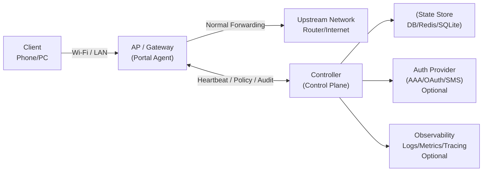
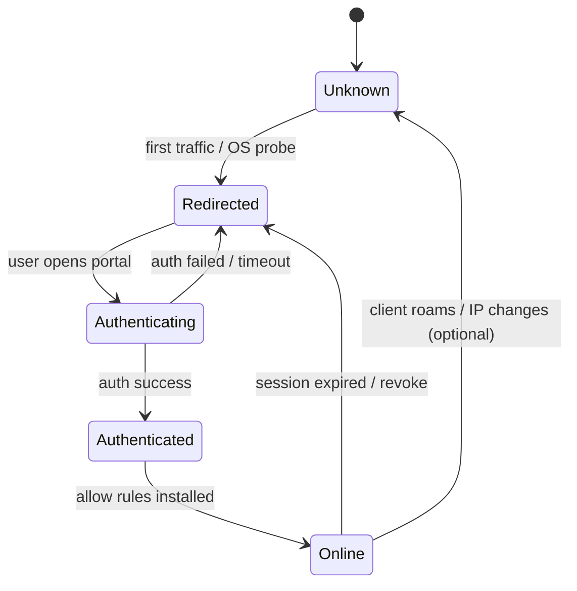
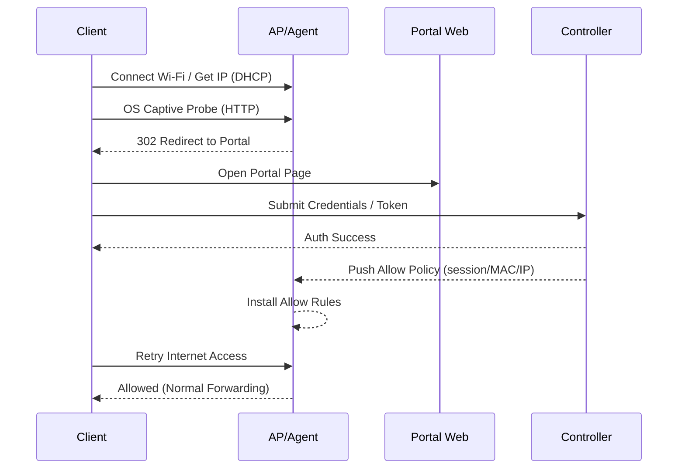

# Architecture / 架构设计

本文档从“对外可讲清楚、对内可落地实现”的角度，描述 Enterprise AP & Captive Portal 平台的整体架构、关键组件边界、核心数据流与控制流。

---

## 1. Architecture Overview / 架构总览

系统采用 **Controller / Agent** 的经典网络产品架构：

- **Control Plane（控制平面 / Controller）**
  - 负责 **集中管理、策略计算、认证与审计、状态汇聚**
  - **不承载用户转发数据**（避免性能瓶颈与单点转发风险）

- **Data Plane（数据平面 / Portal Agent）**
  - 驻留在 **AP / 网关 / 边缘节点**
  - 负责 **流量识别、Portal 劫持、放行执行、就近转发**
  - 与 Controller 保持 **心跳与策略同步**

---

## 2. Logical Topology / 逻辑拓扑

---

## 3. Component Responsibilities / 组件职责边界

### 3.1 Controller（控制平面）

**职责：**

* AP 注册与生命周期管理（注册、心跳、在线状态）
* 策略模型管理（策略版本、灰度/回滚、按 AP/站点/SSID 下发）
* 会话/认证状态管理（用户认证、会话续期/回收）
* 审计与事件记录（认证事件、策略变更、异常告警）
* Northbound API（对接运营平台/第三方 AAA）

**非职责：**

* 不做转发面数据路径（不做 L2/L3 转发，不做 NAT）
* 不在控制器上处理每包决策（避免延迟与扩展瓶颈）

---

### 3.2 Portal Agent（数据平面）

**职责：**

* 识别用户状态（未知/未认证/已认证/隔离）
* 执行 Portal 行为（HTTP Redirect、DNS 劫持/引导）
* 放行执行（基于 MAC/IP/Session 的精准放行）
* 就近转发（认证后流量不绕行控制面）
* 本地容错（控制面短暂不可达时的策略缓存/降级）

**关键约束：**

* HTTPS 不做中间人劫持（无证书注入、无终端侵入）
* 依赖 OS Captive Portal Detection 触发 Portal 入口

---

## 4. Control vs Data Path / 控制流与数据流

### 4.1 Data Path（用户数据流）

* 未认证用户：

  * **HTTP** 流量被重定向到 Portal 页面
  * **DNS** 可被引导到 Portal（可选策略）
  * 其他流量默认隔离/最小放行（例如只允许探测 URL）

* 已认证用户：

  * 命中放行规则，恢复正常上网
  * 流量路径：**Client → AP/Agent → Upstream**（不经过 Controller）

### 4.2 Control Path（控制流）

* Agent ↔ Controller：

  * 心跳 / 在线状态
  * 策略下发 / 版本同步
  * 审计事件上报
  * 认证结果回传（或由 Controller 直接驱动）

---

## 5. Portal State Machine / Portal 状态机

建议用“可运维”的有限状态机表达用户状态：

**实现要点（工程化）：**

* 状态变更必须可审计（谁、何时、为何变更）
* 认证成功 ≠ 在线：必须以“放行规则生效”为 Online 判据
* 支持 Session 过期回收、手动踢下线、黑白名单覆盖

---

## 6. OS Captive Portal Detection / 终端系统探测机制

Portal 入口的“稳定性”主要来自 OS 原生探测：

* iOS / macOS：访问 Apple 的 captive 检测 URL
* Android：访问 generate_204 类 URL（期望返回 204）
* Windows：访问 msftconnecttest 类 URL（期望返回固定文本）

**策略原则：**

* 通过 **HTTP 返回行为** 触发探测页面弹出
* 不依赖 HTTPS 劫持（避免证书与安全风险）
* 探测 URL 应纳入“最小放行白名单”与“重定向策略”统一管理

---

## 7. End-to-End Sequence / 端到端时序

### 7.1 未认证 → 认证 → 放行

---

## 8. Policy Model / 策略模型

### 8.1 策略粒度（建议）

* 站点/区域（Site）
* SSID / VLAN
* AP 组（AP Group）
* 用户维度（User/Role）
* 终端维度（MAC/IP/Device Fingerprint 可选）

### 8.2 策略生命周期

* Versioned Policy（带版本号）
* Agent 侧缓存最新已生效策略（支持断链容错）
* 支持灰度（按 AP 组/百分比）
* 支持回滚（快速恢复）

---

## 9. Observability / 可观测性与运维

### 9.1 必备指标（建议）

* AP 在线数、心跳延迟、策略版本分布
* Portal Redirect 命中率、认证成功率、平均认证耗时
* 放行规则安装成功率、会话在线数、会话过期回收数
* OS 探测 URL 命中统计（按 iOS/Android/Windows）

### 9.2 日志（强烈建议结构化）

最少字段：

* timestamp, ap_id, client_mac, client_ip, session_id
* event_type（redirect/auth/allow/revoke）
* policy_version, result_code, latency_ms

---

## 10. Failure & Degradation / 故障与降级

### 10.1 Controller 不可用

* Agent 使用缓存策略继续工作
* 新会话认证可选择：

  * 降级为“禁止上网”
  * 或放行受限白名单（可配置）
* 关键：确保行为可预测、可审计

### 10.2 Agent 重启

* 会话可从 Controller 重建，或从本地缓存恢复（取决于设计）
* 推荐：将“已认证状态”与“放行规则”绑定到可恢复的 session store

---

## 11. Security Considerations / 安全考虑

* 不做 HTTPS 劫持（避免中间人风险）
* 控制面 API 需要鉴权（Token/JWT/mTLS）
* Agent 与 Controller 通道建议使用 TLS/mTLS
* 审计日志不可篡改（至少 append-only，最好可外送）

---

## 12. References / 关联文档

* `overview.md`：总体介绍与能力概览
* `control-plane.md`：控制面接口与模块细节
* `data-plane.md`：数据面规则、流量路径与实现建议
* `captive-portal.md`：Portal 业务流程与会话模型
* `os-portal-detection.md`：各 OS 探测机制与适配策略
* `deployment.md`：部署方式与参数
* `healthcheck.md`：健康检查与监控点
* `troubleshooting.md`：排障 Runbook

---
