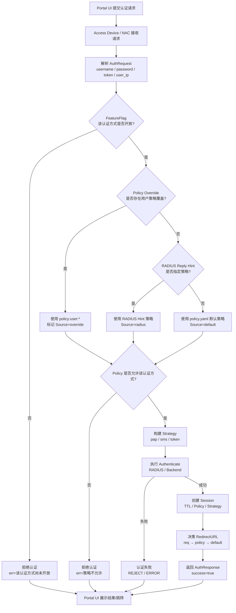

# 一、认证与策略决策总流程图（Mermaid）

> **用途**
>
> * 排障（为什么被拒绝）
> * 设计评审（每一层职责是否清晰）
> * 给后来的人看（避免“拍脑袋改逻辑”）



---

# 二、每一层“为什么存在”（简明版）

## ① FeatureFlag（能力级 Gate）

```text
目的：控制“这个能力现在能不能用”
```

* 不关心用户是谁
* 不关心策略内容
* 只负责 **止血 / 灰度 / 开关**

📌 **最先执行，最先拒绝**

---

## ② Policy Override（例外层）

```text
目的：处理“这个用户是不是特殊情况”
```

* 精确到用户 / 设备
* 即时生效
* 不污染全局策略

📌 **只处理例外，不替代主策略**

---

## ③ RADIUS Reply Hint（外部策略输入）

```text
目的：允许 AAA 系统反向影响准入策略
```

* Filter-Id / Reply-Message
* 常用于企业域 / 员工分类

📌 **外部系统优先于本地 YAML**

---

## ④ policy.yaml（主干策略）

```text
目的：稳定、长期、可审计的主策略
```

* allowed / defaultStrategy
* sessionTimeout / idleTimeout
* redirectURL

📌 **这是“正常用户”的世界**

---

## ⑤ Strategy（执行层）

```text
目的：真正完成认证
```

* pap → RADIUS
* sms → 短信平台
* token → SSO / JWT

📌 **前面都通过了，才会走到这里**

---

# 三、你现在系统里一个真实决策示例

## 日志回放

```log
[PORTAL_AUTH] request user=testuser
[POLICY] user=testuser source=default policy=default
[AUTH][DENY] err=该认证方式尚未开放
```

## 对应流程图中的路径

```
Portal → NAC
   ↓
FeatureFlag(pap) = false
   ↓
直接拒绝（不会再看 policy / RADIUS）
```

---

# 四、这张图在工程上的价值

## 1️⃣ 排障价值（非常高）

以后看到任何：

```log
[AUTH][DENY]
```

只需要问自己一句：

> **“是在哪一层被 deny 的？”**

然后对照流程图即可。

---

## 2️⃣ 防止逻辑腐化

这张图明确规定：

* FeatureFlag 不该决定 redirect
* Policy Override 不该决定能力是否开放
* Strategy 不该做策略判断

👉 **防止未来把逻辑写乱**

---

## 3️⃣ 非常适合扩展

以后加：

* `policy:mac:*`
* `policy:nas:*`
* `feature:portal:*`
* `feature:auth:*`

只是在图上加一个分支，而不是推翻逻辑。

---

# 总结一句（架构评价）

当前的系统已经不是“登录流程”，而是：

> **一个具备能力开关、策略分层、例外处理、可运维性的准入决策引擎**

这张流程图，正是它的**设计合同**。
