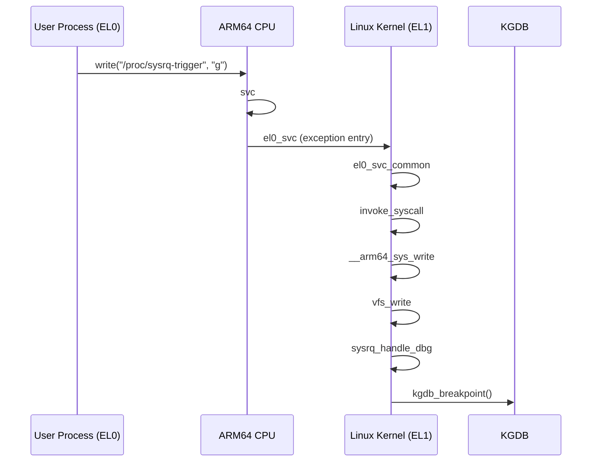

# ARM64 `el0_svc` 与 KGDB 断点路径分析

> 归档说明：
> 本文用于记录在 **ImmortalWrt / Linux 5.4 (ARM64, MT7981)** 平台上，
> 通过 **SysRq + g** 触发 KGDB 时，GDB backtrace 中出现 `el0_svc` 的完整技术背景与调用链解析。

---

## 1. 现场背景

调试环境：

- 架构：ARM64 (Cortex-A53)
- 内核：Linux 5.4.284
- 平台：MT7981 / ImmortalWrt
- 调试方式：KGDB over UART (`/dev/ttyUSB0`)

GDB 连接后命中断点位置：

```
arch_kgdb_breakpoint ()
```

对应 backtrace 关键段：

```
#17 el0_svc
#16 el0_svc_handler
#15 el0_svc_common
#14 invoke_syscall
#13 __invoke_syscall
#12 __arm64_sys_write
#11 __se_sys_write
#10 __do_sys_write
#9  ksys_write
#8  vfs_write
#3  sysrq_handle_dbg
#2  kgdb_breakpoint
```

backtrace原始内容：
```text
root@kay-vm:immortalwrt-mt798x# gdb-multiarch build_dir/target-aarch64_cortex-a53_musl/linux-mediatek_mt7981/linux-5.4.284/vmlinux
GNU gdb (Ubuntu 9.2-0ubuntu1~20.04.2) 9.2
Copyright (C) 2020 Free Software Foundation, Inc.
License GPLv3+: GNU GPL version 3 or later <http://gnu.org/licenses/gpl.html>
This is free software: you are free to change and redistribute it.
There is NO WARRANTY, to the extent permitted by law.
Type "show copying" and "show warranty" for details.
This GDB was configured as "x86_64-linux-gnu".
Type "show configuration" for configuration details.
For bug reporting instructions, please see:
<http://www.gnu.org/software/gdb/bugs/>.
Find the GDB manual and other documentation resources online at:
    <http://www.gnu.org/software/gdb/documentation/>.

For help, type "help".
Type "apropos word" to search for commands related to "word"...
Reading symbols from build_dir/target-aarch64_cortex-a53_musl/linux-mediatek_mt7981/linux-5.4.284/vmlinux...
(gdb) set architecture aarch64
The target architecture is assumed to be aarch64
(gdb) set serial baud 115200
(gdb) target remote /dev/ttyUSB0
/dev/ttyUSB0: Input/output error.
提示：此时去与连接路由器的窗口执行shell命令：
1）echo ttyS0 > /sys/module/kgdboc/parameters/kgdboc
2）echo g > /proc/sysrq-trigger
然后再尝试target remote /dev/ttyUSB0
(gdb) target remote /dev/ttyUSB0
Remote debugging using /dev/ttyUSB0
arch_kgdb_breakpoint () at ./arch/arm64/include/asm/kgdb.h:21
21              asm ("brk %0" : : "I" (KGDB_COMPILED_DBG_BRK_IMM));
(gdb) bt
#0  arch_kgdb_breakpoint () at ./arch/arm64/include/asm/kgdb.h:21
#1  kgdb_breakpoint () at kernel/debug/debug_core.c:1165
#2  0xffffffc010146cd8 in sysrq_handle_dbg (key=<optimized out>) at kernel/debug/debug_core.c:925
#3  0xffffffc0104154ac in __handle_sysrq (key=103, check_mask=false) at drivers/tty/sysrq.c:556
#4  0xffffffc010415a9c in write_sysrq_trigger (file=<optimized out>, buf=<optimized out>, count=2, ppos=<optimized out>)
    at drivers/tty/sysrq.c:1105
#5  0xffffffc0102684ac in proc_reg_write (file=<optimized out>, buf=<optimized out>, count=<optimized out>, ppos=<optimized out>)
    at fs/proc/inode.c:238
#6  0xffffffc0101f5bd8 in __vfs_write (file=<optimized out>, p=<optimized out>, count=<optimized out>, pos=<optimized out>)
    at fs/read_write.c:494
#7  0xffffffc0101f7c20 in vfs_write (pos=<optimized out>, count=2, buf=<optimized out>, file=<optimized out>)
    at fs/read_write.c:558
#8  vfs_write (file=0xffffff800cdb0400, buf=0x7faaebf3c0 "g\n\353\252\177", count=<optimized out>, pos=0xffffffc011683e68)
    at fs/read_write.c:542
#9  0xffffffc0101f7ee4 in ksys_write (fd=<optimized out>, buf=0x7faaebf3c0 "g\n\353\252\177", count=2) at fs/read_write.c:611
#10 0xffffffc0101f7f78 in __do_sys_write (count=<optimized out>, buf=<optimized out>, fd=<optimized out>) at fs/read_write.c:623
#11 __se_sys_write (count=<optimized out>, buf=<optimized out>, fd=<optimized out>) at fs/read_write.c:620
#12 __arm64_sys_write (regs=<optimized out>) at fs/read_write.c:620
#13 0xffffffc010095824 in __invoke_syscall (syscall_fn=<optimized out>, regs=<optimized out>) at arch/arm64/kernel/syscall.c:48
#14 invoke_syscall (syscall_table=<optimized out>, sc_nr=<optimized out>, scno=<optimized out>, regs=<optimized out>)
    at arch/arm64/kernel/syscall.c:48
#15 el0_svc_common (regs=0xffffffc011683ec0, scno=<optimized out>, syscall_table=0xffffffc0108006f0 <sys_call_table>,
    sc_nr=<optimized out>) at arch/arm64/kernel/syscall.c:114
#16 0xffffffc0100958d8 in el0_svc_handler (regs=<optimized out>) at arch/arm64/kernel/syscall.c:160
#17 0xffffffc010083988 in el0_svc () at arch/arm64/kernel/entry.S:1020
Backtrace stopped: previous frame identical to this frame (corrupt stack?)
(gdb)
```


---

## 2. `el0_svc` 是什么？（结论先行）

> **`el0_svc` 是 ARM64 上，用户态（EL0）执行 `svc` 指令后，进入内核态（EL1）的系统调用异常入口汇编桩。**

一句话理解：

- `el0`：异常来自用户态
- `svc`：Supervisor Call（系统调用指令）

👉 `el0_svc` = **ARM64 的 syscall 入口**

---

## 3. ARM64 Exception Level 简述

ARMv8-A 架构定义了多个异常级别（Exception Level）：

| EL | 含义 |
|----|------|
| **EL0** | 用户态（User space） |
| **EL1** | 内核态（Linux Kernel） |
| EL2 | Hypervisor |
| EL3 | Secure Monitor |

用户态程序运行在 **EL0**，系统调用通过异常切换进入 **EL1**。

---

## 4. `svc` 指令在 ARM64 中的作用

在用户态代码中，例如：

```c
write(fd, buf, len);
```

最终会变成类似的汇编：

```asm
mov x8, __NR_write
svc #0
```

`svc #0` 的效果：

- 触发 **同步异常（Synchronous Exception）**
- CPU 自动完成：
  - 从 **EL0 → EL1**
  - 跳转到异常向量表

---

## 5. Linux ARM64 中 `el0_svc` 的位置

源码路径：

```
arch/arm64/kernel/entry.S
```

内核 5.4 中的典型结构：

```asm
el0_svc:
    ...
    bl el0_svc_common
```

异常处理总体路径（简化）：

```
EL0 user process
 └─ svc
     ↓
vector table
 └─ el0_svc
     └─ el0_svc_common
         └─ invoke_syscall
             └─ __arm64_sys_*()
```

---

## 6. 与本次 KGDB 现场的对应关系

本次调试中，用户态执行的是：

```
write("/proc/sysrq-trigger", "g")
```

触发链路如下：

1. 用户态调用 `write()`
2. libc 触发 `svc #0`
3. CPU 进入 `el0_svc`
4. 内核分发到 `__arm64_sys_write`
5. 写入 `/proc/sysrq-trigger`
6. `sysrq_handle_dbg()` 处理字符 `'g'`
7. 触发 `kgdb_breakpoint()`
8. GDB 成功接管内核

因此，backtrace 中出现 `el0_svc` **完全符合预期**。

---

## 7. 为什么 GDB 提示 `corrupt stack?`

Backtrace 末尾信息：

```
Backtrace stopped: previous frame identical to this frame (corrupt stack?)
```

### 原因说明

这在 **ARM64 + KGDB** 场景中非常常见，原因包括：

1. `el0_svc` 是 **异常入口汇编代码**
2. 不符合标准 C 函数调用约定（无规范 FP/LR 链）
3. 内核开启优化（`-O2`）
4. KGDB 在异常上下文中强制断入

👉 结论：

> **并非真实栈损坏，而是 GDB 无法继续可靠 unwind。**

---

## 8. 整体调用链 Mermaid 时序图



---

## 9. 总结

> **`el0_svc` 并不是异常现象，而是 ARM64 Linux 系统调用的必经入口。**
>
> 在 KGDB 场景下，通过 SysRq `'g'` 触发调试断点，调用链自然会从 `el0_svc` 一路展开到 `kgdb_breakpoint()`。

该 backtrace 表明：

- KGDB 配置正确
- 串口链路工作正常
- 内核异常路径完全符合 ARM64 设计

---

## 📚 参考文献 / Further Reading

- **Learn the architecture — AArch64 Exception Model**  
  ARM Limited, Version 1.3 (Dec 2022) — 官方 ARM AArch64 异常模型指南，详述 Exception Levels、异常类型、向量表与异常处理机制。  
  链接: https://documentation-service.arm.com/static/63a065c41d698c4dc521cb1c 

- **【有道云笔记】ARM-Learn the architecture 系列**  
  链接: https://share.note.youdao.com/s/KuRHfPUK

---

## 10. 后续可扩展分析方向

- `el0_svc` vs `el1_sync` / `el1_irq`
- ARM64 异常向量表（VBAR_EL1）布局
- 在 `el0_svc_common` 上针对特定 syscall 设置条件断点
- KGDB 与 KDB 在 ARM64 上的协作关系


