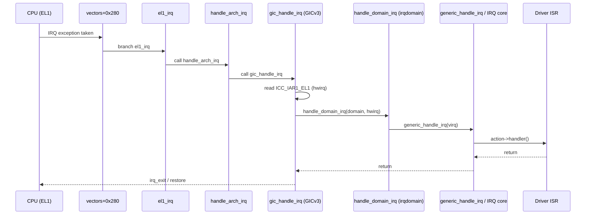
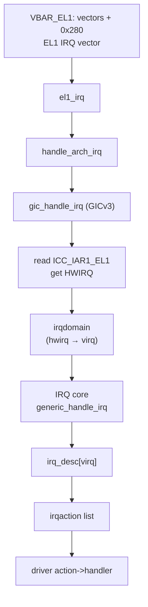

# ARM64 `el1_irq` → GICv3 → irqdomain：指令级实证（Linux 5.4 / KGDB）

> 归档说明：
> 本文以 **KGDB over UART** 为前提，在 **Linux 5.4 (ARM64)** 上对 **EL1 IRQ 入口 → GICv3 中断分发 → irqdomain 映射 → 驱动 handler** 的完整链路做“同级别实证”。
>
> 本文目标：
> - 用 **GDB 断点 + 反汇编 + 符号** 证明每一跳的真实发生
> - 给出一套可重复的操作步骤：抓到一次硬中断后，把它从 `el1_irq` 一路追到 `request_irq()` 注册的 handler
>
> 适用场景：
> - MT7981 等 ARM64 SoC（通常使用 GICv3 或 GICv2 兼容模式）
> - OpenWrt/ImmortalWrt 内核 bring-up
> - 调试“中断不来 / 中断风暴 / affinity 异常 / handler 没被调用”等问题

---

## 1. 总览：从异常入口到驱动回调的“链路地图”

Linux ARM64 上一次典型硬中断的路径（高层）：

```
VBAR_EL1 + 0x280 (Current EL, SPx, IRQ)
  → vectors+0x280 → el1_irq
    → handle_arch_irq
      → gic_handle_irq (GICv3)
        → irq_enter
        → (read ICC_IAR1_EL1 / GICC_IAR)
        → handle_domain_irq
          → irqdomain 映射 (hwirq → virq)
          → generic_handle_irq
            → handle_irq_event
              → action->handler()   (驱动 request_irq 注册)
        → irq_exit
```

---

## 2. 前置：确认你内核的 IRQ 向量槽位与入口符号

已在前文实证：

- `vectors` 是 EL1 异常向量表
- `vectors + 0x280` 跳转到 `el1_irq`

验证命令（GDB）：

```gdb
p/x &vectors
x/32i (vectors + 0x280)
```

你应当看到关键跳转：

```asm
b el1_irq
```

---

## 3. 一次“实证抓中断”的标准操作流程（KGDB）

### 3.1 在入口链路上布置断点

建议按“从上到下”逐级布点（命中后再逐步精简）：

```gdb
# 1) EL1 IRQ 汇编/C 入口
b el1_irq

# 2) 架构层中断分发
b handle_arch_irq

# 3) GICv3 的 IRQ handler（常见符号名）
b gic_handle_irq

# 4) irqdomain 分发入口
b handle_domain_irq
b __handle_domain_irq

# 5) generic IRQ core
b generic_handle_irq
b handle_irq_event
b handle_irq_event_percpu
```

> 说明：
> - 不同配置/补丁下符号名可能略有差异；若 `b gic_handle_irq` 报 no symbol，可用 `info functions gic` 或 `nm vmlinux | grep -i gic_handle_irq` 查实际符号。

### 3.2 触发一次“确定会来的中断”

最稳妥的触发源：

- **定时器**（tick）
- **网卡 RX/TX 中断**（发包/收包）
- **串口**（疯狂输出）

建议你在目标机执行（任选其一）：

```sh
# 触发网卡相关（如果驱动是中断模式）
ping -f -c 1000 192.168.1.1

# 或者大量串口输出
for i in $(seq 1 2000); do echo $i; done
```

当 GDB 断到 `el1_irq`，说明已经抓到一次 EL1 IRQ。

---

## 4. 进入 `gic_handle_irq` 后：如何确认“是哪一个 IRQ”

### 4.1 GICv3 读取 IAR 得到 hwirq

GICv3 典型做法是读取 `ICC_IAR1_EL1`（Group 1）或 `ICC_IAR0_EL1`（Group 0）。

在 Linux 5.4 中，这通常封装在 `gic_read_iar()` 或类似 inline 中。

#### 你能在 KGDB 里验证的方式（不依赖 system reg 可见性）

1) 在 `gic_handle_irq` 命中后，单步若干指令，观察是否执行了 `mrs` 指令：

```gdb
x/40i $pc
si
```

2) 或直接在 `gic_handle_irq` 里找 `mrs`：

```gdb
disassemble /m gic_handle_irq
```

你会看到类似：

```asm
mrs x0, ICC_IAR1_EL1
```

> 注：部分 KGDB stub 不暴露 system regs 给 `info registers`，但 **反汇编仍能看到 mrs 指令**。

### 4.2 从 IAR 值提取中断号

IAR 返回值通常包含：

- `INTID`（中断号，常见 0..1020）
- 以及一些标志位（实现相关）

Linux 通常会做 mask：

```c
irqnr = read_iar() & 0x3ff;
```

在 GDB 中，你可以在 `gic_handle_irq` 读完 IAR 后查看保存该值的寄存器（常见 x0/w0）。

---

## 5. `handle_domain_irq`：hwirq → virq 的核心分界线

### 5.1 irqdomain 的作用

> irqdomain 用来将 **硬件中断号 hwirq（来自 GIC）** 映射为 **Linux 内核统一的 virq（软件 IRQ 编号）**。

这层解决了：

- 多级中断控制器
- SoC 不同外设的 hwirq 分配
- 中断控制器层级（GIC → GPIO controller → 设备）

### 5.2 实证点：在 `handle_domain_irq` 查看参数

当你在 `handle_domain_irq` / `__handle_domain_irq` 断住时，关注：

- `struct irq_domain *domain`
- `unsigned int hwirq`

在 ARM64 ABI 下，常见传参寄存器：

- x0 = domain
- x1 = hwirq

（以实际反汇编/源码为准）

你可以在断点处：

```gdb
info registers x0 x1 x2 x3
```

并尝试：

```gdb
p/x $x1
```

如果能符号化类型（带 debug info），还可以：

```gdb
p *(struct irq_domain*)$x0
```

---

## 6. `generic_handle_irq` 到驱动 handler：最终落点

### 6.1 IRQ core 的关键对象

Linux 中断核心对象关系：

- `irq_desc[virq]`：每个 virq 的描述符
- `irq_desc->action`：链表，包含一个或多个 handler
- `action->handler`：驱动注册的 ISR

### 6.2 实证抓 handler

在 `generic_handle_irq` 或 `handle_irq_event_percpu` 断住后：

1) 找到当前 virq：

- 常见在参数或局部变量中（可用 `bt` + `info args` + `info locals`）

2) 打印 `irq_desc`：

```gdb
p irq_desc[<virq>]
```

3) 打印 action 链：

```gdb
p *irq_desc[<virq>].action
```

如果没有类型信息（编译裁剪），可以退化为：

- 直接观察 `handle_irq_event_percpu` 中调用函数指针的位置
- 使用 `x/gx` 查看结构体内存

---

## 7. 两张图：时序图 + 分层架构图（便于归档）

### 7.1 时序图（异常入口到驱动 handler）



### 7.2 分层结构图（GIC + irqdomain + handler）



---

## 8. 诊断技巧：把一次中断映射到 /proc 与 sysfs

当你拿到 `virq` 后，建议同步在目标机验证：

```sh
cat /proc/interrupts

# 查某个 irq 的详细信息
ls -l /sys/kernel/irq/<virq>/
cat /sys/kernel/irq/<virq>/chip_name
cat /sys/kernel/irq/<virq>/hwirq
cat /sys/kernel/irq/<virq>/actions
cat /sys/kernel/irq/<virq>/smp_affinity_list
```

这能把 KGDB 看到的 virq/hwirq 与用户态可见信息对齐。

---

## 9. 常见坑（与你当前 KGDB 现象高度相关）

### 9.1 为什么读不到 `$VBAR_EL1` / system registers？

- KGDB stub 往往只暴露通用寄存器
- system registers（如 VBAR_EL1 / ESR_EL1 / ICC_*）可能无法通过 `info registers` 直接读取

解决思路：

- 通过 **反汇编** 观察 `mrs/msr` 指令
- 通过 **符号** 与 **控制流** 等价证明（本文即此方法）

### 9.2 `el1_fiq_invalid` 出现是否异常？

不异常：大部分 Linux 平台不用 FIQ，因此 FIQ 向量槽位会跳到 `*_invalid`。

---

## 10. 建议的“实证最小脚本”（你可以直接复制用）

```gdb
# 入口到分发链路
b el1_irq
b handle_arch_irq
b gic_handle_irq
b handle_domain_irq
b __handle_domain_irq
b generic_handle_irq
b handle_irq_event_percpu

# 触发后
c

# 命中后查看调用栈与关键寄存器
bt
info args
info locals
info registers x0 x1 x2 x3 x4 x5
```

---

## 11. 参考文献

- ARM Ltd. **Learn the architecture — AArch64 Exception Model**  
  https://documentation-service.arm.com/static/63a065c41d698c4dc521cb1c

- Linux kernel source (5.4):
  - `arch/arm64/kernel/entry.S`（异常向量与 `el1_irq` 入口）
  - `drivers/irqchip/irq-gic-v3.c`（`gic_handle_irq`，IAR/EOI）
  - `kernel/irq/irqdomain.c`（`handle_domain_irq` / `__handle_domain_irq`）
  - `kernel/irq/handle.c`（`generic_handle_irq` / `handle_irq_event_*`）

（完）

