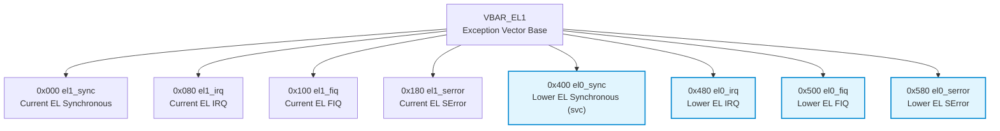

# ARM64 异常向量表（VBAR_EL1）布局详解

> 归档说明：
> 本文用于系统整理 **ARM64（AArch64）异常向量表 VBAR_EL1 的架构定义与 Linux 实现**，
> 结合 Linux 5.4（ARM64）内核源码与 KGDB 实际调试场景，作为内核 / SoC bring-up 阶段的长期参考文档。

---

## 1. 什么是 VBAR_EL1

> **VBAR_EL1（Vector Base Address Register, EL1）**
> 指向 **EL1（内核态）异常向量表的基地址**。

当 ARM64 CPU 发生异常（同步异常、中断或系统错误）时，CPU 会：

1. 判断当前 Exception Level（EL）
2. 判断异常来源（Current EL / Lower EL）
3. 判断异常类型（Synchronous / IRQ / FIQ / SError）
4. 计算并跳转到：

```
PC = VBAR_EL1 + offset
```

---

## 2. ARM64 异常模型的基本分类

ARM64 的异常向量由 **两个维度**共同决定。

### 2.1 异常来源（Where from）

| 来源 | 含义 |
|----|----|
| **Current EL** | 异常发生在 EL1（内核态） |
| **Lower EL** | 异常来自 EL0（用户态） |

### 2.2 异常类型（What type）

| 类型 | 说明 |
|----|----|
| **Synchronous** | 同步异常（`svc`、data abort、instruction abort） |
| **IRQ** | 普通中断 |
| **FIQ** | 快速中断 |
| **SError** | 系统错误（异步 abort） |

👉 组合结果：**2 × 4 = 8 个异常入口**。

---

## 3. ARMv8-A 规范中的 VBAR_EL1 向量布局

ARMv8-A 架构规定：

- **每个异常向量占用 0x80（128）字节**
- 向量表按固定顺序排列

```
VBAR_EL1
├── 0x000 : Current EL, SP0, Synchronous
├── 0x080 : Current EL, SP0, IRQ
├── 0x100 : Current EL, SP0, FIQ
├── 0x180 : Current EL, SP0, SError
├── 0x200 : Current EL, SPx, Synchronous
├── 0x280 : Current EL, SPx, IRQ
├── 0x300 : Current EL, SPx, FIQ
├── 0x380 : Current EL, SPx, SError
├── 0x400 : Lower EL (EL0), Synchronous
├── 0x480 : Lower EL (EL0), IRQ
├── 0x500 : Lower EL (EL0), FIQ
└── 0x580 : Lower EL (EL0), SError
```

📌 说明：
- ARM64 架构下，**Lower EL 不再区分 SP0 / SPx**
- 用户态异常统一通过 Lower EL 向量进入内核

---

## 4. Linux ARM64（5.4）中的实际实现

### 4.1 向量表定义位置

Linux ARM64 内核中，异常向量表定义在：

```
arch/arm64/kernel/entry.S
```

关键符号：

```asm
VMLINUX_SYMBOL(__vectors)
```

内核启动阶段，会将该地址写入：

```asm
msr VBAR_EL1, x0
isb
```

---

### 4.2 Linux 中的异常入口对应关系

| Offset | Linux 入口符号 | 说明 |
|----|----|----|
| 0x000 | el1_sync | 内核态同步异常 |
| 0x080 | el1_irq | 内核态 IRQ |
| 0x100 | el1_fiq | 内核态 FIQ |
| 0x180 | el1_serror | 内核态 SError |
| 0x400 | el0_sync | 用户态同步异常（syscall / abort） |
| 0x480 | el0_irq | 用户态 IRQ |
| 0x500 | el0_fiq | 用户态 FIQ |
| 0x580 | el0_serror | 用户态 SError |

📌 **`el0_svc` 就是 `el0_sync` 路径中的 syscall 子分支。**

---

## 5. 与 KGDB 调试场景的对应关系

在实际调试中，典型路径如下：

```text
EL0 用户态
 └─ write()
     └─ svc #0
         ↓
VBAR_EL1 + 0x400 (el0_sync)
 └─ el0_svc
     └─ el0_svc_common
         └─ invoke_syscall
```

这正是 KGDB backtrace 中看到 `el0_svc` 的根本原因。

---

## 6. VBAR_EL1 向量表 Mermaid 全景图



---

## 7. 为什么每个异常向量必须是 0x80 字节

这是 ARMv8-A 的**硬性 ABI 设计要求**，原因包括：

- 向量入口是 **裸汇编**
- 必须完成：
  - 寄存器保存
  - 栈切换（SP0 / SPx）
  - 异常上下文构建
- 保证异常嵌套时不会破坏相邻向量

👉 因此 0x80 并非浪费，而是异常处理的最小安全空间。

---

## 8. 调试实践建议

### 8.1 常用 GDB 断点

```gdb
b el0_sync
b el0_svc
b el1_irq
```

### 8.2 查看当前 VBAR_EL1

```gdb
p/x $VBAR_EL1
```

或在内核代码中：

```c
read_sysreg(vbar_el1);
```

---

## 9. 总结

> **VBAR_EL1 定义了 ARM64 内核异常处理的“入口地图”。**
>
> Linux 严格遵循 ARMv8-A 的 8 向量布局，你在 KGDB 中看到的 `el0_svc`，
> 本质上就是 **VBAR_EL1 + 0x400 的用户态同步异常入口**。

---

## 10. 参考文献

- ARM Ltd. **Learn the architecture — AArch64 Exception Model**  
  https://documentation-service.arm.com/static/63a065c41d698c4dc521cb1c


