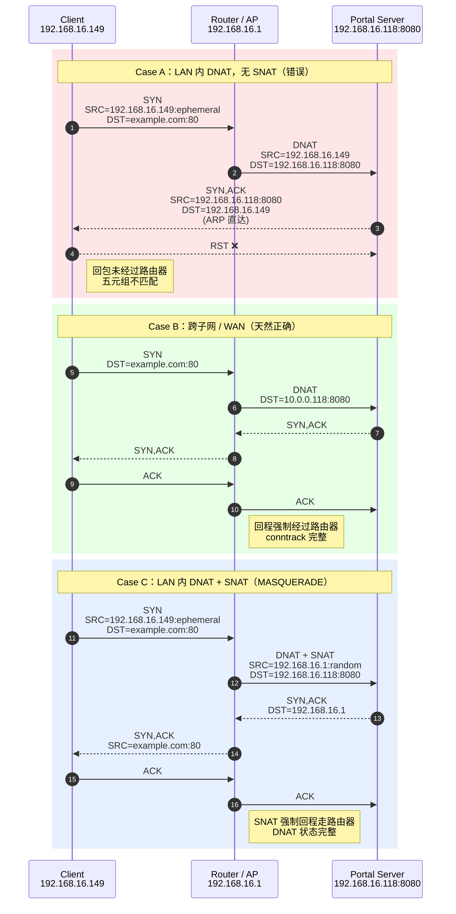

## **Why LAN-side Captive Portal DNAT Requires SNAT**

> **LAN 内 Captive Portal 的 DNAT / SNAT 回程问题分析**

---

## 1. 背景（Background）

在企业 AP / AC 架构中，**Captive Portal** 通常用于未认证终端的访问控制：

* 客户端连接 Wi-Fi
* 任意 HTTP 请求被劫持（DNAT）到 Portal
* 用户完成认证后放行

常见部署中，Portal 服务位于 **AC 或独立服务器**，而 AP / 路由器负责数据面拦截。

### 本文讨论的特殊场景

> **Portal Server 与路由器（AP）位于同一 LAN 网段**

示意：

```
[ Client ] 192.168.16.149
     |
     |  (br-lan)
     |
[ Router / AP ] 192.168.16.1
     |
     |  (same L2 / same subnet)
     |
[ Portal Server ] 192.168.16.118:8080
```

---

## 2. 问题现象（Symptoms）

### 表面现象

* Portal 页面**偶尔能弹**
* 浏览器访问被卡住
* 抓包显示 TCP 被 **RST**

### 路由器侧 tcpdump 抓包

```text
Client → Portal   SYN
Portal → Client   SYN, ACK
Client → Portal   RST
```

或者：

```text
SYN → SYN/ACK → 无 ACK → 重传 → RST
```

### Docker服务器侧 tcpdump 抓包

```text
192.168.16.149 → 192.168.16.118:8080 [SYN]
192.168.16.118 → 192.168.16.149 [SYN, ACK]
192.168.16.149 → 192.168.16.118 [RST]
```

👉 **TCP 三次握手无法完成**

---

## 3. 原因分析（Root Cause）

### 3.1 DNAT 在 LAN 内的隐藏问题

在 Captive Portal 中，我们通常做：

```sh
# PREROUTING
iptables -t nat -A PREROUTING \
  -i br-lan -p tcp --dport 80 \
  -j DNAT --to 192.168.16.118:8080
```

此时发生的是：

* 客户端以为在访问 `example.com:80`
* 实际被 DNAT 到 `192.168.16.118:8080`

**但注意：源 IP 没变！**

```text
SRC = 192.168.16.149
DST = 192.168.16.118
```

---

### 3.2 同网段的致命点（关键）

Portal Server 与 Client **在同一个子网**：

* Portal Server **直接 ARP 回客户端**
* 回包 **绕过路由器**
* 客户端收到一个 **“不符合期望的 TCP 报文”**

于是客户端内核判定：

> **这不是我发起的连接 → 发送 RST**

---

### 3.3 为什么跨网段不会出问题？

如果 Portal 在 **不同子网 / WAN**：

* 回包必须经过路由器
* DNAT 状态完整
* conntrack 正常

👉 **只有“同一 LAN”才会踩这个坑**

### 3.4 DNAT 回程问题对比：无 SNAT vs 有 SNAT（LAN 内）



---

## 4. 本质结论（一句话版）

> **LAN 内 Captive Portal 场景中，仅 DNAT 不够，必须配合 SNAT（MASQUERADE），否则 TCP 回程会被客户端 RST。**

---

## 5. 正确解决方案（Solution）

### 5.1 必须添加 SNAT / MASQUERADE

在 **POSTROUTING** 增加：

```sh
iptables -t nat -A POSTROUTING \
  -d 192.168.16.118 -p tcp --dport 8080 \
  -j MASQUERADE
```

### 作用解释

| 项目             | 变化     |
| -------------- | ------ |
| Client 看到的源 IP | 路由器 IP |
| Portal 回包      | 回到路由器  |
| conntrack      | 状态完整   |
| TCP            | 三次握手成功 |

---

### 5.2 iptables SNAT规则写法（幂等）

```sh
# SNAT for LAN-side portal (critical)
iptables -t nat -C POSTROUTING \
  -d "${PORTAL_IP}" -p tcp --dport "${PORTAL_PORT}" \
  -j MASQUERADE 2>/dev/null || \
iptables -t nat -A POSTROUTING \
  -d "${PORTAL_IP}" -p tcp --dport "${PORTAL_PORT}" \
  -j MASQUERADE
```

---

## 6. 验证方法（Verification）

### 6.1 iptables 计数器

```sh
iptables -t nat -L POSTROUTING -v -n
```

应看到：

```text
MASQUERADE tcp -- 0.0.0.0/0 192.168.16.118 tcp dpt:8080
```

并且 **pkts/bytes 持续增长**

---

### 6.2 tcpdump 正确表现

```text
Client → Router → Portal
Portal → Router → Client
ACK 完整
HTTP 正常返回
```

---

## 7. 工程级经验总结（Takeaways）

### 必须牢记的规则

1. **同网段 DNAT = 必须 SNAT**
2. Portal 不在本机 ≠ 不需要 SNAT
3. “偶尔能弹”通常是 TCP 被 RST 的信号
4. 抓包一定要看 **RST 来自谁**

---

## 8. 商用 AC 的实际做法

| 厂商            | 行为                       |
| ------------- | ------------------------ |
| Cisco / Aruba | 默认 SNAT Portal 流量        |
| Ruijie / H3C  | Portal 走 AC IP           |
| UniFi         | Controller IP masquerade |

---

## 9. 总结（Final）

> 这是一个**不写下来一定会再踩一次**的坑。
> DNAT 能把流量“送过去”，
> **SNAT 才能把流量“带回来”。**

---
