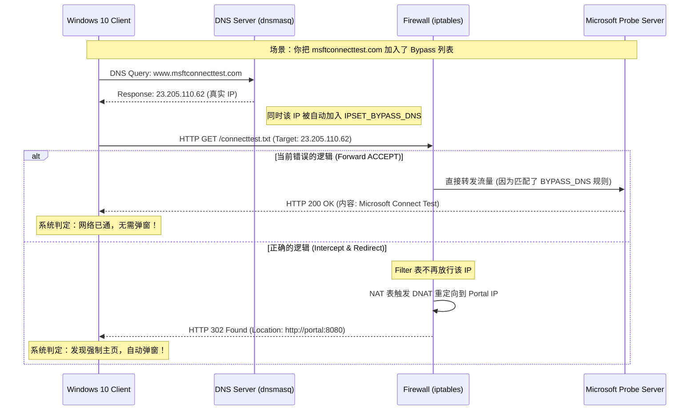

# OS Captive Portal Detection Domains

## Overview

现代操作系统在接入 Wi-Fi 网络后，通常会通过 **特定域名的 HTTP/DNS 请求**
来判断网络是否需要用户认证（Captive Portal Detection）。

如果这些请求被拦截或 HTTPS 被劫持，OS 将无法正确弹出 Portal 页面，
导致“已连接但无法上网”的用户体验问题。

本项目通过 **DNS + ipset 域名旁路机制**，对这些探测域名进行白名单放行，
从而 **正确触发系统级 Portal 行为**。

---

## Design Principles

### 1️⃣ DNS-based Decision Only

- 不劫持 HTTPS
- 不伪造 DNS 响应
- 仅在 DNS 解析阶段标记目标 IP

---

### 2️⃣ Suffix Matching Only

> 使用 `example.com`，而不是 `*.example.com`

dnsmasq 的 `ipset=/example.com/setname`：
- 自动匹配所有子域
- 兼容 CNAME 链
- 行为稳定、可预测

---

### 3️⃣ OS-first Compatibility

优先保证：
- Windows / iOS / Android / HarmonyOS
- Portal 自动弹出
- 用户零操作接入体验

---

## Windows

### Detection Domains

```text
msftconnecttest.com
www.msftconnecttest.com
```

### Behavior

* Windows 发起 HTTP 请求
* 检测返回内容是否符合预期
* 若失败则弹出 Portal 浏览器

---



## Apple (iOS / macOS)

### Detection Domains

```text
captive.apple.com
apple.com
```

### Behavior

* 请求 `captive.apple.com/hotspot-detect.html`
* 期望返回特定文本
* 不满足即触发 Portal

---

## Android / Google

### Detection Domains

```text
clients3.google.com
www.gstatic.com
google.com
```

### Behavior

* Android 使用 Google connectivity check
* HTTPS + HTTP 混合
* 依赖 DNS 正确性

---

## Huawei / HarmonyOS

### Detection Domains

```text
connectivitycheck.hicloud.com
connectivitycheck.platform.hicloud.com
wifi.vmall.com
wifi.huawei.com
```

### Behavior

* HarmonyOS 使用华为自有检测服务
* 与 Android 类似，但域名不同
* HTTPS 请求较多

---

## Recommended Bypass Domain List

### Production-safe Configuration

```yaml
bypass:
  enabled: true
  domains:
    # Windows
    - msftconnecttest.com
    - www.msftconnecttest.com

    # Apple
    - captive.apple.com
    - apple.com

    # Android / Google
    - clients3.google.com
    - gstatic.com

    # Huawei / HarmonyOS
    - connectivitycheck.hicloud.com
    - connectivitycheck.platform.hicloud.com
    - wifi.vmall.com
    - wifi.huawei.com
```

---

## dnsmasq Configuration Example

```ini
ipset=/msftconnecttest.com/portal_bypass_dns
ipset=/captive.apple.com/portal_bypass_dns
ipset=/clients3.google.com/portal_bypass_dns
ipset=/connectivitycheck.hicloud.com/portal_bypass_dns
```

---

## Validation Checklist

在 AP 上执行：

```bash
nslookup www.msftconnecttest.com
ipset list portal_bypass_dns
```

期望看到解析 IP 被自动加入 ipset。

---

## Common Mistakes

### ❌ 使用通配符

```text
*.microsoft.com
```

原因：

* dnsmasq 不支持 glob
* 行为不可预测

---

### ❌ 错误的 ipset 类型

```text
hash:mac
```

域名旁路必须使用：

```text
hash:ip
```

---

### ❌ HTTPS 劫持

* 会破坏 OS 探测逻辑
* 导致 Portal 不弹或反复弹

---

## Security Considerations

* 仅放行 OS 探测域名
* 不应将通用搜索 / CDN 域名加入白名单
* 定期审计 bypass 列表

---

## Extensibility

该机制可扩展支持：

* 自定义终端检测域名
* IoT 设备探测流量
* 企业终端（MDM）检测

---

## Summary

通过对 OS Captive Portal Detection 域名的精确旁路：

* 保证 Portal 自动弹出
* 避免 HTTPS 劫持
* 提供一致的跨平台用户体验

**DNS → ipset → firewall** 的设计，
是当前 OpenWrt / ImmortalWrt 环境下
最安全、最稳定的 Captive Portal 旁路方案。
