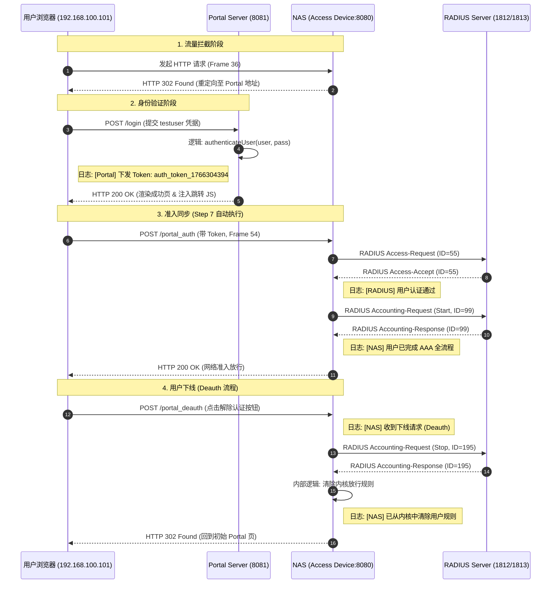

# Portal 认证与 RADIUS 计费全流程时序分析 (Portal-AAA-Sequence)

本记录详细说明了用户从发起请求到认证成功，再到主动下线（Deauth）的全过程，关联了 `portal-server-go` 与 `NAS (access_device)` 的运行日志。

## 1. 认证交互时序图

---

## 2. 关键节点与日志对照

### 2.1 编译环境准备

在执行测试前，两个模块均通过以下方式完成编译，以支持深度调试：

* **Portal Server**: `go build -gcflags="all=-N -l" -o portal-server .` (位于 `portal-server-go/`)
* **NAS (Access Device)**: `go build -gcflags="all=-N -l" -o access-device .` (位于 `access_device/`)

### 2.3 运行日志审计 (2025/12/21)

| 时序步骤 | 组件 | 关键日志输出 | 关联报文 |
| --- | --- | --- | --- |
| 5-6 | Portal | `[Portal] 用户 testuser 登录成功, 下发 Token: auth_token_...` | Frame 45-46 |
| 8-11 | NAS | `[RADIUS] 用户 testuser 认证通过 (Access-Accept)` | Frame 56-59 |
| 11 | NAS | `用户 testuser 已完成 AAA 全流程。` | Frame 64 |
| 13-16 | NAS | `[NAS] 收到下线请求 (Deauth)... 发送 Accounting-Request (Stop)` | Frame 69-70 |

---

## 3. 资源文件引用

* **抓包存档**: `docs/artifacts/pcap/cap_auth_test.pcap`
* **调试截图**: `docs/assets/images/portal_test_on_vm.jpg`
* **代码定义**:
* 样式提取：`portal-server-go/assets.go`
* 核心校验：`portal-server-go/main.go` 中的 `authenticateUser`
* 规则清理：`access_device/main.go` 中的 `portalDeauthHandler`

---

## 4. 调试说明

若需使用 GDB 重现此流程，请在以下位置打断点：

1. `b portal-server-go/main.go:authenticateUser` (拦截登录校验)
2. `b access_device/main.go:portalDeauthHandler` (拦截下线清理)
