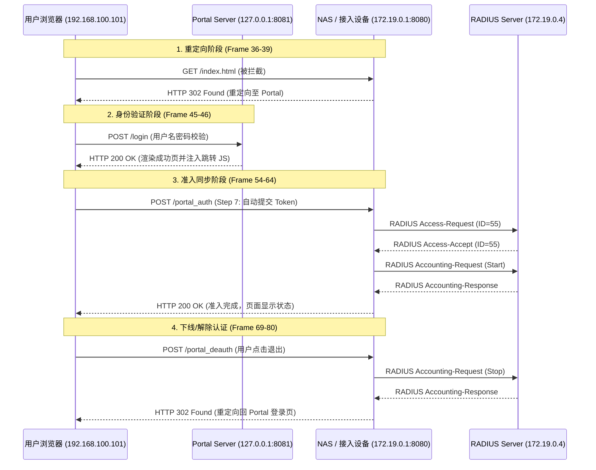

# Portal 认证与下线流程分析报告

## 1. 业务流程概述

本项目的 Captive Portal 认证遵循标准的 Web 重定向与后端同步逻辑。用户在通过 Portal 页面校验后，由浏览器自动向接入设备 (NAS) 提交 Token，随后 NAS 与 RADIUS 服务器完成身份准入与计费启动。

### 交互时序图



---

## 2. 项目目录结构与文件作用

### 2.1 根目录文件

* **`go.mod` / `go.sum**`: 项目依赖配置文件，定义了 RADIUS 通信及其他第三方库版本。
* **`Dockerfile`**: 用于构建和部署容器化认证环境。
* **`README.md`**: 项目总体设计说明与快速上手手册。

### 2.2 接入设备模块 (`access_device/`)

该模块模拟 NAS (Network Access Server) 行为，负责底层协议转换。

* **`main.go`**:
* **拦截重定向**：捕获未认证流量并 302 跳转至 Portal。
* **RADIUS 交互**：处理来自客户端的 `/portal_auth` 请求，封装并发送 RADIUS 报文。
* **下线控制**：提供 `/portal_deauth` 接口，触发计费停止 (Accounting-Stop) 流程。


* **`main` / `access_device**`: 编译后的可执行文件，用于在宿主机或容器内直接运行。

### 2.3 门户服务模块 (`portal-server-go/`)

处理用户接入的第一层交互，负责 UI 展示与身份校验。

* **`main.go`**:
* **业务逻辑入口**：包含 `handleLogin` 处理函数及核心校验逻辑 `authenticateUser` (GDB 断点建议位置)。
* **数据注入**：生成验证 Token 并将其注入到前端模板中。


* **`assets.go`**:
* **前端静态资源**：独立存放 `CommonCSS` (视觉样式)、`SuccessJS` (处理 1.5s 延迟跳转) 和 `FailureJS` (处理错误倒计时)。
* **作用**：解耦 Go 逻辑与 HTML/JS/CSS，提高前端交互的可维护性。


* **`template.go`**:
* **HTML 结构**：定义了认证成功 (Success) 与失败 (Failure) 的页面骨架。
* **动态渲染**：通过 `%s` 占位符接收后端传入的用户名、Token 及跳转 URL。


* **`main` / `portal-server-go**`: 编译后的门户服务端可执行文件。

---

## 3. 调试与归档资源

### 资源文件路径参考

| 类别 | 存放路径 | 说明 |
| --- | --- | --- |
| **抓包文件** | `docs/artifacts/pcap/cap_auth_test_on_vm.pcap` | 包含图示中完整的 Auth/Acct 报文交互 |
| **参考规范** | `docs/artifacts/specs/WLAN_AC_..._用户接入与认证配置.pdf` | 厂商对接配置标准 |
| **时序图脚本** | `docs/portal-aaa-auth-sequence.md`  |包含tcpdump抓包对应的 Mermaid 图表
| **截图证明** | `docs/assets/images/portal_test_on_vm.jpg` | Wireshark 流量分析对比图 |

---

## 4. 调试要点 (Troubleshooting)

1. **GDB 调试**:
* 验证校验分支：`b portal-server-go/main.go:authenticateUser`
* 验证下线分支：`b access_device/main.go:portalDeauthHandler`


2. **编译命令**: 需携带禁止优化参数以保证 GDB 能够正确读取变量值：
`go build -gcflags="all=-N -l" -o main .`

---

## 5. 编译与运行记录归档

### 5.1 编译指令

在 `kay-vm` 开发环境下，为了支持 GDB 调试（禁用内联和优化）并生成对应的二进制文件，按以下步骤执行编译：

```bash
# 1. 编译门户服务端 (Portal Server)
cd ~/enterprise_ap_impl/captive-portal/portal-server-go
go build -gcflags="all=-N -l" -o portal-server

# 2. 编译接入设备模拟器 (Access Device)
cd ~/enterprise_ap_impl/captive-portal/access_device
go build -gcflags="all=-N -l" -o access-device

```

### 5.2 运行日志实时分析

以下是基于 2025/12/21 实测日志的业务流拆解：

#### 阶段 A：Portal 认证授权 (Port :8081)

当用户在浏览器输入凭据并提交时，Portal Server 记录如下：

```log
2025/12/21 16:06:34 [Portal] 用户 testuser 登录成功, 下发 Token: auth_token_1766304394

```

* **分析**：此步骤对应时序图中的 Frame 45-46。此时服务端已验证用户身份，并向浏览器返回了包含 Token 的跳转脚本。

#### 阶段 B：NAS 准入与 RADIUS AAA 流程 (Port :8080)

NAS 接收到来自浏览器的 `portal_auth` 请求后，触发与 RADIUS 的后端交互：

```log
[RADIUS] 正在为用户 testuser 发起认证请求...
[RADIUS] 用户 testuser 认证通过 (Access-Accept)
[RADIUS] 正在为用户 testuser 发起计费开始请求...
用户 testuser 已完成 AAA 全流程。

```

* **分析**：此日志确认了 Frame 54-64 的执行。NAS 先后完成了 `Access-Request` 和 `Accounting-Request (Start)`。

#### 阶段 C：用户主动下线 (Deauth 流程)

当用户点击“解除认证”按钮时，NAS 执行清理任务：

```log
2025/12/21 16:06:39 [NAS] 收到下线请求 (Deauth)，用户: testuser
2025/12/21 16:06:39 [RADIUS-Acct] 发送 Accounting-Request (Stop): 用户=testuser
2025/12/21 16:06:39 [NAS] 已从内核中清除用户 testuser 的放行规则

```

* **关键点**：日志显示 NAS 成功发送了 **Stop** 报文（Frame 70），并执行了关键的内核级操作（清除放行规则），实现了真正的“网络断开”。

---

## 6. 实验环境摘要 (Context)

* **宿主机**: `kay@kay-vm`
* **网络架构**:
* **Portal IP**: `172.19.0.4` (容器/虚拟网卡)
* **NAS IP**: `172.19.0.1`


* **时间戳**: 2025-12-21 16:00 ~ 16:06 (对应 `cap_auth_test.pcap` 抓包时间段)

---