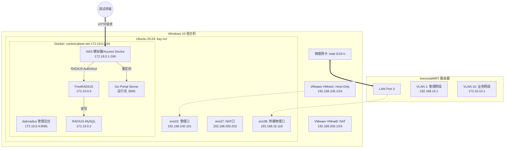

# Portal 认证测试环境网络拓扑说明 (Portal-Testbed-Topology)

本文详细记录了进行 Go 语言 Portal 认证测试时的物理硬件、虚拟机（VMware）以及 Docker 容器之间的层级拓扑关系。

## 1. 实验环境概览

* **开发宿主机**: Windows 10 企业版 (22H2)
* **虚拟化平台**: VMware Workstation
* **核心网关**: ImmortalWRT (HiLink RM65)
* **测试虚拟机**: Ubuntu 20.04 (kay-vm) —— 运行 Portal Server 与 NAS 模拟器

## 2. 逻辑拓扑图 (Mermaid)



## 3. 关键网络参数映射

### 3.1 接入设备与认证服务 (Docker 侧)

| 组件名称 | 容器 IP | 作用 | 关联日志标识 |
| --- | --- | --- | --- |
| **NAS (Access Device)** | 172.19.0.1 | 拦截 HTTP 并重定向，发送 RADIUS 报文 | `[NAS] 收到下线请求 (Deauth)` |
| **Portal Server** | 172.19.0.4 (宿主映射) | 处理登录 UI，下发 Token | `[Portal] 用户登录成功, 下发 Token` |
| **FreeRADIUS** | 172.19.0.5 | 核心 AAA 认证/计费处理 | `[RADIUS] 用户认证通过 (Access-Accept)` |

### 3.2 虚拟机网络接口 (VMware 侧)

* **ens33 (192.168.100.101)**: 关联 VMnet1。用于宿主机对 VM 进行 GDB 调试和 SSH 访问。
* **ens38 (192.168.16.118)**: 关联物理网卡 I219-V。直接桥接到 ImmortalWRT 路由器的管理 VLAN。

### 3.3 路由器接口 (ImmortalWRT 侧)

* **br-lan.1 (192.168.16.1)**: 管理网段，负责实验室基础设备互联。
* **br-lan.10 (172.16.10.1)**: 业务网段 (VLAN 10)，对应 `lan3` 端口，作为 Portal 认证的受控网段。

## 4. 路由与配置参考

* **VLAN 过滤**: 已在 ImmortalWRT 开启 `vlan_filtering '1'`。
* **桥接配置**: `lan3` 属于 VLAN 10 (PVID Egress Untagged)，`rax0` 同样绑定到 VLAN 10。
* **Docker 网络**: 使用驱动 `bridge`，子网 `172.19.0.0/16`，由 Docker Compose 项目 `control-plane` 管理。

---


## 5. 物理层与虚拟化环境 (Physical & Virtualization)

| 节点名称 | 硬件/操作系统 | 网络接口映射 (Interface Mapping) | IP 地址分配 |
| --- | --- | --- | --- |
| **Win10 Host** | Win10 Enterprise 22H2 | VMnet1 (Host-Only) | 192.168.100.1/24 |
|  |  | VMnet8 (NAT) | 192.168.200.1/24 |
|  |  | Intel I219-V (Physical) | 直连 ImmortalWRT LAN3 |
| **ImmortalWRT** | HiLink RM65 (OpenWrt) | eth1 (WAN) | 192.168.124.68 (DHCP) |
|  |  | br-lan.1 (VLAN 1) | 192.168.16.1/24 |
|  |  | br-lan.10 (VLAN 10) | 172.16.10.1/24 |
| **Ubuntu 20.04** | kay-vm | ens33 (VMnet1) | 192.168.100.101 |
|  |  | ens37 (VMnet8) | 192.168.200.202 |
|  |  | ens38 (Bridge/I219-V) | 192.168.16.118 |

---

## 6. ImmortalWRT 二层交换配置 (Bridge & VLAN)

```bash
# Bridge VLAN Filtering: Enabled
# VLAN 1  : lan1(U), lan2(U), lan4(U), br-lan(Self)
# VLAN 10 : lan3(U), lan4(T), rax0(U), br-lan(Self)

root@ImmortalWrt:/tmp# bridge -p -d vlan
port              vlan-id
lan1              1 PVID Egress Untagged
lan2              1 PVID Egress Untagged
lan3              10 PVID Egress Untagged
lan4              1 PVID Egress Untagged
                  10
rax0              10 PVID Egress Untagged
br-lan            1
                  10

```

```text
root@ImmortalWrt:/tmp# cat /etc/config/network

config globals 'globals'
        option ula_prefix 'fd7a:83f7:1ff7::/48'

config device
        option name 'br-lan'
        option type 'bridge'
        option vlan_filtering '1'
        list ports 'lan1'
        list ports 'lan2'
        list ports 'lan3'
        list ports 'lan4'

config bridge-vlan
        option device 'br-lan'
        option vlan '1'
        list ports 'lan1:u*'
        list ports 'lan2:u*'
        list ports 'lan4:u*'

config bridge-vlan
        option device 'br-lan'
        option vlan '10'
        list ports 'lan3:u*'
        list ports 'lan4:t'

config interface 'loopback'
        option device 'lo'
        option proto 'static'
        option ipaddr '127.0.0.1'
        option netmask '255.0.0.0'

config interface 'lan'
        option device 'br-lan.1'
        option proto 'static'
        option ip6assign '60'
        list ipaddr '192.168.16.1/24'

config interface 'lan10'
        option device 'br-lan.10'
        option proto 'static'
        option ip6assign '60'
        list ipaddr '172.16.10.1/24'

config interface 'wan'
        option device 'eth1'
        option proto 'dhcp'

config interface 'wan6'
        option device 'eth1'
        option proto 'dhcpv6'

root@ImmortalWrt:/tmp#
root@ImmortalWrt:/tmp# cat /etc/config/dhcp

config dnsmasq
        option domainneeded '1'
        option boguspriv '1'
        option filterwin2k '0'
        option localise_queries '1'
        option rebind_protection '1'
        option rebind_localhost '1'
        option local '/lan/'
        option domain 'lan'
        list interface 'lan'
        list interface 'lan10'
        option expandhosts '1'
        option nonegcache '0'
        option authoritative '1'
        option readethers '1'
        option leasefile '/tmp/dhcp.leases'
        option resolvfile '/tmp/resolv.conf.d/resolv.conf.auto'
        option nonwildcard '1'
        option localservice '1'
        option filter_aaaa '0'
        option cachesize '8000'
        option mini_ttl '3600'
        option dns_redirect '1'
        option ednspacket_max '1232'

config dhcp 'lan'
        option interface 'lan'
        option start '100'
        option limit '150'
        option leasetime '12h'
        option force '1'

        # IPv4 / IPv6 dual-stack
        option dhcpv4 'server'
        option dhcpv6 'hybrid'
        option ra 'hybrid'
        option ndp 'hybrid'
        option ra_management '1'
        list ra_flags 'managed-config'
        list ra_flags 'other-config'


config dhcp 'lan10'
        option interface 'lan10'
        option start '100'
        option limit '150'
        option leasetime '12h'
        option force '1'

        # IPv4 / IPv6 dual-stack
        option dhcpv4 'server'
        option dhcpv6 'hybrid'
        option ra 'hybrid'
        option ndp 'hybrid'
        option ra_management '1'
        list ra_flags 'managed-config'
        list ra_flags 'other-config'


config dhcp 'wan'
        option interface 'wan'
        option ignore '1'

config odhcpd 'odhcpd'
        option maindhcp '0'
        option leasefile '/tmp/hosts/odhcpd'
        option leasetrigger '/usr/sbin/odhcpd-update'
        option loglevel '4'

root@ImmortalWrt:/tmp#
root@ImmortalWrt:/tmp#
root@ImmortalWrt:/tmp# cat /etc/config/wireless

config wifi-device 'MT7981_1_1'
        option type 'mtwifi'
        option phy 'ra0'
        option band '2g'
        option dbdc_main '1'
        option channel 'auto'
        option txpower '100'
        option htmode 'HE40'
        option country 'CN'
        option mu_beamformer '1'
        option noscan '1'
        option serialize '1'
        option disabled '1'

config wifi-iface 'default_MT7981_1_1'
        option device 'MT7981_1_1'
        option network 'lan10'
        option mode 'ap'
        option ssid 'ImmortalWrt-Guest-2.4G'
        option encryption 'none'
        option disabled '1'

config wifi-device 'MT7981_1_2'
        option type 'mtwifi'
        option phy 'rax0'
        option band '5g'
        option dbdc_main '0'
        option txpower '100'
        option htmode 'HE160'
        option country 'CN'
        option mu_beamformer '1'
        option serialize '1'
        option channel 'auto'

config wifi-iface 'default_MT7981_1_2'
        option device 'MT7981_1_2'
        option ifname 'rax0'
        option network 'lan10'
        option mode 'ap'
        option ssid 'ImmortalWrt-Guest-5G'
        option encryption 'none'

root@ImmortalWrt:/tmp#
root@ImmortalWrt:/tmp# cat /etc/config/firewall

config defaults
        option syn_flood '1'
        option input 'ACCEPT'
        option output 'ACCEPT'
        option forward 'REJECT'
        option fullcone '1'

config zone
        option name 'lan_trusted'
        list network 'lan'
        option input 'ACCEPT'
        option output 'ACCEPT'
        option forward 'ACCEPT'

config zone
        option name 'lan_guest'
        list network 'lan10'
        option input 'REJECT'
        option output 'ACCEPT'
        option forward 'REJECT'

config zone
        option name 'wan_uplink'
        list network 'wan'
        list network 'wan6'
        option input 'REJECT'
        option output 'ACCEPT'
        option forward 'REJECT'
        option masq '1'
        option mtu_fix '1'

config forwarding
        option name 'trusted_to_internet'
        option src 'lan_trusted'
        option dest 'wan_uplink'

config forwarding
        option name 'guest_to_internet'
        option src 'lan_guest'
        option dest 'wan_uplink'

config rule
        option name 'Allow-DHCP-from-Guest'
        option src 'lan_guest'
        option proto 'udp'
        option dest_port '67-68'
        option target 'ACCEPT'

config rule
        option name 'Allow-DNS-from-Guest'
        option src 'lan_guest'
        option proto 'tcp udp'
        option dest_port '53'
        option target 'ACCEPT'

config rule
        option name 'Block-Router-Management-from-Guest'
        option src 'lan_guest'
        option proto 'tcp'
        option dest_port '22 23 80 443'
        option target 'REJECT'

config rule
        option name 'Allow-DHCP-Renew-from-WAN'
        option src 'wan_uplink'
        option proto 'udp'
        option dest_port '68'
        option family 'ipv4'
        option target 'ACCEPT'

config rule
        option name 'Allow-Ping-from-WAN'
        option src 'wan_uplink'
        option proto 'icmp'
        option icmp_type 'echo-request'
        option family 'ipv4'
        option target 'ACCEPT'

root@ImmortalWrt:/tmp#
```

---

## 7. Docker 容器服务布局 (Docker Stack)

**Network: `control-plane_control-plane-net` (172.19.0.0/16)**

| 容器名称 (Container) | 镜像 (Image) | 内部 IP | 外部映射端口 |
| --- | --- | --- | --- |
| **radius-mysql** | mysql:8.0 | 172.19.0.2 | 3306 |
| **cp-redis** | redis:7-alpine | 172.19.0.3 | 6379:6379 |
| **daloradius** | daloradius-docker:1.2 | 172.19.0.4 | 8081:80 |
| **freeradius** | freeradius-server:3.2 | 172.19.0.5 | 1812-1813/udp |

---

## 8. Docker 网络详情 (Network Inspect)

```text
kay@kay-vm:access_device$ docker network ls
NETWORK ID     NAME                              DRIVER    SCOPE
78295b20784f   bridge                            bridge    local
1d9d0cd00d98   control-plane_control-plane-net   bridge    local
977ae548ac5b   control-plane_default             bridge    local
069284197a43   host                              host      local
c390748787d6   none                              null      local
kay@kay-vm:access_device$
kay@kay-vm:access_device$ docker network inspect control-plane_control-plane-net
[
    {
        "Name": "control-plane_control-plane-net",
        "Id": "1d9d0cd00d98d6c925b87eb42972025e0ba241bf94f5cdcebfab71b3369a099f",
        "Created": "2025-12-21T13:28:06.873163648+08:00",
        "Scope": "local",
        "Driver": "bridge",
        "EnableIPv4": true,
        "EnableIPv6": false,
        "IPAM": {
            "Driver": "default",
            "Options": null,
            "Config": [
                {
                    "Subnet": "172.19.0.0/16",
                    "Gateway": "172.19.0.1"
                }
            ]
        },
        "Internal": false,
        "Attachable": false,
        "Ingress": false,
        "ConfigFrom": {
            "Network": ""
        },
        "ConfigOnly": false,
        "Containers": {
            "4bcb8a4f3a9198d656d5e79edc340c527861ef0bec42d5be519e987f8a4ca73f": {
                "Name": "radius-mysql",
                "EndpointID": "ba4f8c0732650a54d5d3e22a73b22afb4a92fe5d8c8498b030f9b18b8e4c341f",
                "MacAddress": "26:23:0a:63:a7:5e",
                "IPv4Address": "172.19.0.2/16",
                "IPv6Address": ""
            },
            "5a5f8df23b14a6212ee87c0411f1d0d5d63fa5bd8728d5c6ce48500aa1c82973": {
                "Name": "cp-redis",
                "EndpointID": "21cc6b1ef49f957207df0434352d785b004099f5842dfbc91ccd7c84d66ba5f0",
                "MacAddress": "9a:7a:d3:ff:cc:b3",
                "IPv4Address": "172.19.0.3/16",
                "IPv6Address": ""
            },
            "7e26927ffd420be8a53780d0e25220440d9c23d19920644f58c63f110fe8d33c": {
                "Name": "freeradius",
                "EndpointID": "070640cd814d79f148151c0860f11c0977c3826253f4a3e463ec915d1453a546",
                "MacAddress": "92:9a:78:47:5f:f5",
                "IPv4Address": "172.19.0.5/16",
                "IPv6Address": ""
            },
            "a8256680fd3f80e317d95356eea8ec0307640b50602c53fd40c669fa44f21029": {
                "Name": "daloradius",
                "EndpointID": "c49fe42ee4b8727058ad740a4783030728b2b3fccc9c3e7ea3b84499c824f4b0",
                "MacAddress": "2a:9c:38:88:e2:c1",
                "IPv4Address": "172.19.0.4/16",
                "IPv6Address": ""
            }
        },
        "Options": {},
        "Labels": {
            "com.docker.compose.config-hash": "e3f516a539478aa164ef0dc8e936de0495ec9516e46f9b52bfa98f90cac635b7",
            "com.docker.compose.network": "control-plane-net",
            "com.docker.compose.project": "control-plane",
            "com.docker.compose.version": "2.35.1"
        }
    }
]
kay@kay-vm:access_device$
```

---
