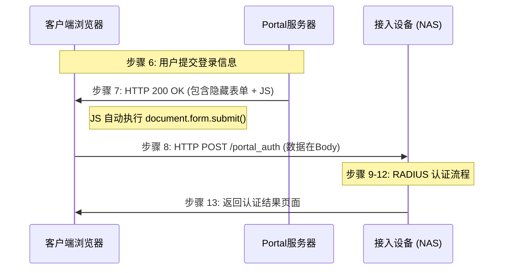
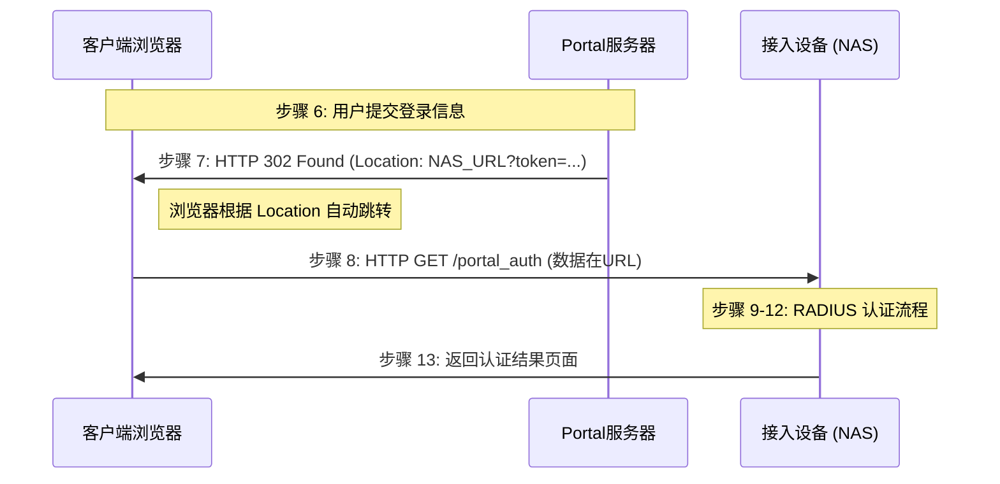

本文涵盖了基于华为 Portal 协议流程图实现的两种技术方案对比、流程图解及完整源代码。

---

# Portal 认证实现方案：JS 自动提交 vs. HTTP 302 重定向

本方案参考华为 Portal 认证标准流程（特别是步骤 7 与步骤 8 的交互逻辑），展示了如何通过 Go 语言模拟 **Portal 服务器** 与 **接入设备 (NAS)** 的核心功能。

## 1. 技术方案对比

| 特性 | **方案 A：JS 自动提交 (POST)** | **方案 B：HTTP 302 重定向 (GET)** |
| --- | --- | --- |
| **交互原理** | 服务器返回包含 `<form>` 和 JS 的 HTML | 服务器发送 `Location` 响应头 |
| **数据位置** | HTTP Body (请求体) | URL Query String (查询参数) |
| **用户体验** | 浏览器会渲染一个短暂的“跳转中”页面 | 直接跳转，无感切换 |
| **安全性** | 较高。敏感数据（Token）不留存在浏览器历史记录中 | 较低。Token 暴露在地址栏，易被截获或重放 |
| **数据限制** | 几乎无限制 | 受限于 URL 长度限制（通常 < 2KB） |

---

## 2. 流程区别说明 (Mermaid)

### 方案 A：JavaScript 自动提交 (POST)



### 方案 B：HTTP 302 重定向 (GET)



---

## 3. 源代码实现

### 版本 A：JavaScript 自动提交方式

#### `v1_post/portal_server/main.go`

```go
package main

import (
	"fmt"
	"net/http"
)

func main() {
	// 模拟步骤 6：处理登录并下发自动提交页面
	http.HandleFunc("/login", func(w http.ResponseWriter, r *http.Request) {
		if r.Method != http.MethodPost { return }
		
		username := r.FormValue("username")
		nasIP := "localhost" // 实际环境中从参数获取

		w.Header().Set("Content-Type", "text/html; charset=utf-8")
		// 步骤 7：利用 JS 自动提交表单到接入设备
		fmt.Fprintf(w, `
			<html>
			<body onload="document.forms[0].submit()">
				<p>正在安全跳转至接入设备...</p>
				<form action="http://%s:8080/portal_auth" method="post">
					<input type="hidden" name="username" value="%s">
					<input type="hidden" name="token" value="secure_token_post_123">
				</form>
			</body>
			</html>
		`, nasIP, username)
	})
	fmt.Println("JS方式 Portal服务器 运行在 :8081...")
	http.ListenAndServe(":8081", nil)
}

```

#### `v1_post/access_device/main.go`

```go
package main

import (
	"fmt"
	"net/http"
)

func main() {
	// 步骤 8：接收客户端 POST 提交的认证请求
	http.HandleFunc("/portal_auth", func(w http.ResponseWriter, r *http.Request) {
		if r.Method != http.MethodPost { return }

		username := r.FormValue("username")
		token := r.FormValue("token")

		fmt.Printf("[POST] 收到认证请求：用户=%s, Token=%s\n", username, token)
		fmt.Fprint(w, "<h1>POST 认证成功！</h1>")
	})
	fmt.Println("JS方式 接入设备 运行在 :8080...")
	http.ListenAndServe(":8080", nil)
}

```

---

### 版本 B：HTTP 302 重定向方式

#### `v2_302/portal_server/main.go`

```go
package main

import (
	"fmt"
	"net/http"
)

func main() {
	// 模拟步骤 6：处理登录并执行 302 跳转
	http.HandleFunc("/login", func(w http.ResponseWriter, r *http.Request) {
		if r.Method != http.MethodPost { return }

		username := r.FormValue("username")
		nasIP := "localhost"
		
		// 步骤 7：构造重定向 URL，参数放在查询字符串中
		authURL := fmt.Sprintf("http://%s:8080/portal_auth?username=%s&token=%s", 
			nasIP, username, "token_302_abc")

		fmt.Printf("执行 302 跳转: %s\n", authURL)
		http.Redirect(w, r, authURL, http.StatusFound)
	})
	fmt.Println("302方式 Portal服务器 运行在 :8081...")
	http.ListenAndServe(":8081", nil)
}

```

#### `v2_302/access_device/main.go`

```go
package main

import (
	"fmt"
	"net/http"
)

func main() {
	// 步骤 8：接收客户端重定向发起的 GET 请求
	http.HandleFunc("/portal_auth", func(w http.ResponseWriter, r *http.Request) {
		// 从 URL 查询参数获取数据
		username := r.URL.Query().Get("username")
		token := r.URL.Query().Get("token")

		fmt.Printf("[GET] 收到 302 跳转请求：用户=%s, Token=%s\n", username, token)
		fmt.Fprint(w, "<h1>302 重定向认证成功！</h1>")
	})
	fmt.Println("302方式 接入设备 运行在 :8080...")
	http.ListenAndServe(":8080", nil)
}

```

---

## 4. 实验建议

在使用 Wireshark 抓包分析时，请重点关注以下特征：

* **JS 方式**：查找 `HTTP 200 OK` 响应，查看其 **Data** 部分是否存在 `<form>` 标签和 `submit()` 脚本。
* **302 方式**：查找 `HTTP 302 Found` 响应，查看其 **Header** 部分是否存在 `Location` 字段。

---

## 5. 辅助分析资源 (Supplemental Resources)

为了深入理解协议实现细节并验证代码逻辑，建议参考以下归档在项目中的补充文档与原始数据：

### 5.1 官方技术规范 (Technical Specification)

本项目实现参考了华为官方关于 WLAN AC 的准入配置指南，详细的协议报文格式和交互状态机可查阅：

* **路径**: `docs/artifacts/specs/WLAN_AC_AirEngine_X700_01-12_用户接入与认证配置.pdf`
* **关键查阅点**:
* Portal 认证流程图（对应文档中的“外部 Portal 认证”章节）。
* 接入设备与 Portal 服务器交互的报文参数列表。


### 5.2 流量抓包分析 (Traffic Capture/PCAP)

为了验证上述 Go 代码实现的正确性（尤其是步骤 7 的重定向行为），可使用 Wireshark 打开以下抓包文件进行比对：

* **路径**: `docs/artifacts/pcap/cap_traffic_between_accessdevice_and_portal_server.pcap`
* **观察重点**:
* **HTTP 302 响应**: 确认 `Location` 头部是否包含正确的 `token` 与 `username` 参数。
* **HTTP POST 报文**: 在 JS 自动提交模式下，确认表单数据（Form Data）是否正确封装在 HTTP 载荷中。
* **交互时序**: 验证从 Portal 服务器重定向到接入设备（8080端口）的端到端时延。


---

## 6. 如何使用本项目进行验证 (How to Test)

1. **环境准备**:
```bash
# 启动 Portal 服务器
go run v1_post/portal_server/main.go
# 启动 接入设备模拟器
go run v1_post/access_device/main.go

```


2. **模拟访问**: 浏览器访问 `http://localhost:8080/index.html`。
3. **抓包验证**: 使用 Wireshark 监听 `Loopback` 网卡，过滤 `tcp.port == 8080 || tcp.port == 8081`，并与 `artifacts/pcap/` 中的标准包进行比对。

---

**文档归档说明：**

* **PDF 手册** 存放在 `specs` 目录，作为协议实现的理论支撑。
* **PCAP 文件** 存放在 `pcap` 目录，作为实际交互的实证数据。
* **MD 文档** 作为索引，将理论、代码与实验数据串联。