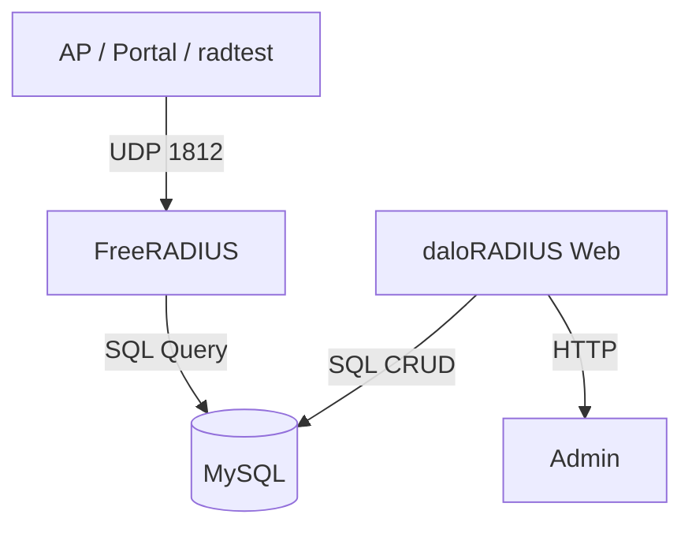
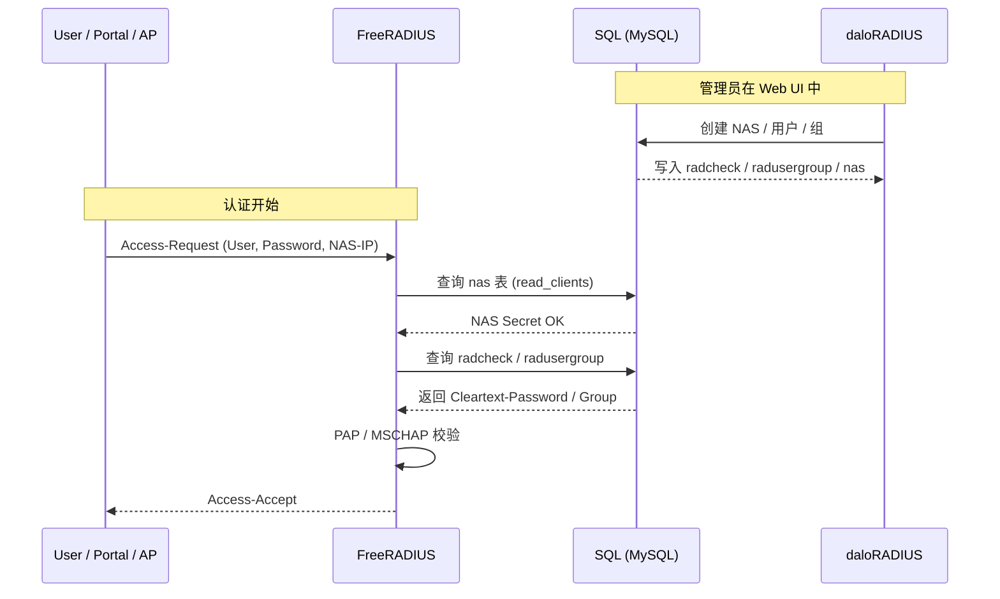

* ✅ **问题全景复盘（Why）**
* ✅ **关键坑位与根因（Root Cause）**
* ✅ **最终正确架构（What is right）**
* ✅ **Docker 服务关系图**
* ✅ **端到端 Mermaid 时序图（Portal → FreeRADIUS → SQL）**
* ✅ **Checklist（以后再也不踩）**

---

# 🧭 FreeRADIUS + daloRADIUS + Docker 调试全记录（踩坑复盘）

> 本文记录一次 **Docker 环境下部署 FreeRADIUS + daloRADIUS + MySQL** 的完整踩坑、定位与修复过程，重点在 **SQL 模块、NAS 动态加载、driver 配置陷阱**。

---

## 1️⃣ 整体架构概览

### Docker 服务组成

| 服务名                     | 作用                    |
| ----------------------- | --------------------- |
| `freeradius`            | RADIUS 认证 / 计费核心      |
| `daloradius`            | Web UI，操作用户 / NAS / 组 |
| `mysql`                 | 后端数据库（radius schema）  |
| `ap / portal / radtest` | RADIUS Client（NAS）    |

---

## 2️⃣ 典型异常现象（Symptoms）

### 2.1 radtest 无响应

```text
Sent Access-Request ...
(no reply)
```

### 2.2 FreeRADIUS Debug 输出

```text
Ignoring request to auth address * port 1812
from unknown client 172.19.0.1
```

### 2.3 daloRADIUS Web 登录失败

```text
either of the following:
1. bad username/password
2. an administrator is already logged-in
3. there appears to be more than one 'administrator' user
```

---

## 3️⃣ 问题一：daloRADIUS 默认账号 & 数据不一致

### ✅ 正确结论

| 项目  | 默认值                                  |
| --- | ------------------------------------ |
| 用户名 | `administrator` / `admin`（取决于导入 SQL） |
| 密码  | 明文（如 `radius` / `admin`）             |
| 存储  | `operators` 表                        |

### 做对的事

```sql
SELECT id, username, password FROM operators;

UPDATE operators
SET password='admin'
WHERE username='admin';
```

```text
kay@kay-vm:enterprise_ap_impl$ docker ps --format "table {{.ID}}\t{{.Image}}\t{{.Status}}\t{{.Names}}"
CONTAINER ID   IMAGE                                            STATUS                          NAMES
6277d5ef7cd3   control-plane-captive-portal                     Up 11 minutes                   captive-portal
c52617d8dd6f   ap-controller-go:latest                          Up 11 minutes                   ap-controller
d7dd0a7b8b3e   frauhottelmann/daloradius-docker:1.2             Up 11 minutes                   daloradius
e4449f24e273   freeradius/freeradius-server:latest-3.2-alpine   Restarting (1) 58 seconds ago   freeradius
f6e61861c6ec   mysql:8.0                                        Up 11 minutes (healthy)         radius-mysql
45ac7ee7dad3   redis:7-alpine                                   Up 11 minutes                   cp-redis
kay@kay-vm:enterprise_ap_impl$
kay@kay-vm:enterprise_ap_impl$
kay@kay-vm:enterprise_ap_impl$ docker exec -it radius-mysql sh
sh-5.1#
sh-5.1#
sh-5.1#
sh-5.1# mysql -u radius -p radius
Enter password:
Reading table information for completion of table and column names
You can turn off this feature to get a quicker startup with -A

Welcome to the MySQL monitor.  Commands end with ; or \g.
Your MySQL connection id is 85
Server version: 8.0.37 MySQL Community Server - GPL

Copyright (c) 2000, 2024, Oracle and/or its affiliates.

Oracle is a registered trademark of Oracle Corporation and/or its
affiliates. Other names may be trademarks of their respective
owners.

Type 'help;' or '\h' for help. Type '\c' to clear the current input statement.

mysql>
mysql> show tables
    -> ;
+------------------------+
| Tables_in_radius       |
+------------------------+
| batch_history          |
| billing_history        |
| billing_merchant       |
| billing_paypal         |
| billing_plans          |
| billing_plans_profiles |
| billing_rates          |
| dictionary             |
| hotspots               |
| invoice                |
| invoice_items          |
| invoice_status         |
| invoice_type           |
| nas                    |
| node                   |
| operators              |
| operators_acl          |
| operators_acl_files    |
| payment                |
| payment_type           |
| proxys                 |
| radacct                |
| radcheck               |
| radgroupcheck          |
| radgroupreply          |
| radpostauth            |
| radreply               |
| radusergroup           |
| realms                 |
| userbillinfo           |
| userinfo               |
+------------------------+
31 rows in set (0.00 sec)

mysql> select id, username, password from operators;
+----+---------------+----------+
| id | username      | password |
+----+---------------+----------+
|  6 | administrator | radius   |
+----+---------------+----------+
1 row in set (0.00 sec)

mysql> select * from nas;
+----+------------+-----------+-------+-------+------------+--------+-----------+-------------+
| id | nasname    | shortname | type  | ports | secret     | server | community | description |
+----+------------+-----------+-------+-------+------------+--------+-----------+-------------+
|  1 | 172.19.0.1 | docker    | other |     0 | testing123 |        |           | docker host |
+----+------------+-----------+-------+-------+------------+--------+-----------+-------------+
1 row in set (0.00 sec)

mysql> exit
Bye
sh-5.1# exit
exit
kay@kay-vm:enterprise_ap_impl$
kay@kay-vm:enterprise_ap_impl$
```

✔ **Web UI 登录成功**

---

## 4️⃣ 问题二：radtest 一直显示 unknown client

### 4.1 你已经做了“看似正确”的事

```sql
INSERT INTO nas (nasname, secret)
VALUES ('172.19.0.1', 'testing123');
```

```conf
read_clients = yes
client_table = "nas"
```

**但仍然：**

#### 1）freeradius 日志显示 Ignoring request

```text
Listening on auth address * port 1812 bound to server default
Listening on acct address * port 1813 bound to server default
Listening on auth address :: port 1812 bound to server default
Listening on acct address :: port 1813 bound to server default
Listening on auth address 127.0.0.1 port 18120 bound to server inner-tunnel
Listening on proxy address * port 46379
Listening on proxy address :: port 35638
Ready to process requests
Ignoring request to auth address * port 1812 bound to server default from unknown client 172.19.0.1 port 51765 proto udp
Ready to process requests
```

#### 2）radtest 无响应

```text
kay@kay-vm:~$ radtest testuser testpass 172.19.0.4 0 testing123
Sent Access-Request Id 15 from 0.0.0.0:34962 to 172.19.0.4:1812 length 78
        User-Name = "testuser"
        User-Password = "testpass"
        NAS-IP-Address = 127.0.1.1
        NAS-Port = 0
        Cleartext-Password = "testpass"
Sent Access-Request Id 15 from 0.0.0.0:34962 to 172.19.0.4:1812 length 78
        User-Name = "testuser"
        User-Password = "testpass"
        NAS-IP-Address = 127.0.1.1
        NAS-Port = 0
        Cleartext-Password = "testpass"
Sent Access-Request Id 15 from 0.0.0.0:34962 to 172.19.0.4:1812 length 78
        User-Name = "testuser"
        User-Password = "testpass"
        NAS-IP-Address = 127.0.1.1
        NAS-Port = 0
        Cleartext-Password = "testpass"
(0) No reply from server for ID 15 socket 3
kay@kay-vm:~$
```

---

## 5️⃣ 🚨 真正的致命坑：`rlm_sql_null`

### ❌ 原始配置（问题根因）

```conf
dialect = "mysql"

driver = "rlm_sql_null"
driver = "rlm_sql_${dialect}"
```

### 如何发现的？答案：还是freeradius启动日志

```text
Could not link driver rlm_sql_mysql: Error loading shared library libmariadb.so.3: No such file or directory (needed by /opt/lib/rlm_sql_mysql.so)
Make sure it (and all its dependent libraries!) are in the search path of your system's ld
/opt/etc/raddb/mods-enabled/sql[27]: Instantiation failed for module "sql"
```


### 🧠 rlm_sql_null 是什么？

> **假 SQL 驱动（Debug Stub）**

它的行为是：

* ✔ 解析 SQL
* ✔ 打印 SQL
* ❌ 永远不连数据库
* ❌ 永远读不到 `nas`
* ❌ 永远查不到用户

👉 **FreeRADIUS 表现为“像在跑，其实是空转”**

---

## 6️⃣ ✅ 正确修复方式（你最终做对的事）

### 只保留这一行：

```conf
driver = "rlm_sql_${dialect}"
```

并确保：

```conf
dialect = "mysql"
```

### 实际生效结果

```text
rlm_sql_mysql.so loaded
```

✔ SQL 真正连接

✔ `read_clients = yes` 生效

✔ NAS 动态加载成功

✔ radtest → Access-Accept

---

## 7️⃣ Docker 服务关系图（逻辑层）



---

## 8️⃣ 🔥 核心 Mermaid 时序图（认证全流程）



---

## 9️⃣ FreeRADIUS Debug 快速判定法（必背）

| 现象               | 结论                     |
| ---------------- | ---------------------- |
| 能启动 ≠ SQL 正常     | ❌                      |
| unknown client   | `read_clients` 未生效     |
| SQL 无报错但无数据      | **90% 是 rlm_sql_null** |
| `radiusd -X` 必须看 | ✔                      |

---

## 🔟 Checklist（以后再也不踩）

### SQL 模块

* [x] `driver != rlm_sql_null`
* [x] `rlm_sql_mysql.so` 存在
* [x] libmariadb.so 可加载
* [x] `mods-enabled/sql` 被 include

### NAS

* [x] `read_clients = yes`
* [x] `nas` 表有 IP / secret
* [x] IP ≠ 127.0.0.1（Docker 下）

### 测试

* [x] `radtest user pass ip 0 secret`
* [x] FreeRADIUS `-X` 无 unknown client
* [x] 收到 Access-Accept

---

## 11️⃣ 总结

> **FreeRADIUS 能跑 ≠ SQL 在工作**
> **`rlm_sql_null` 是最隐蔽、最致命、最浪费时间的陷阱**

---

## 🚀 下一步

1. Portal → RADIUS 的真实放行策略
2. radgroupreply 做 VLAN / Filter-Id / Session-Timeout
3. FreeRADIUS 拆分 auth / acct / coa
4. Docker → K8s 迁移版架构
5. OpenWrt / AP 对接（Portal / 802.1X）

