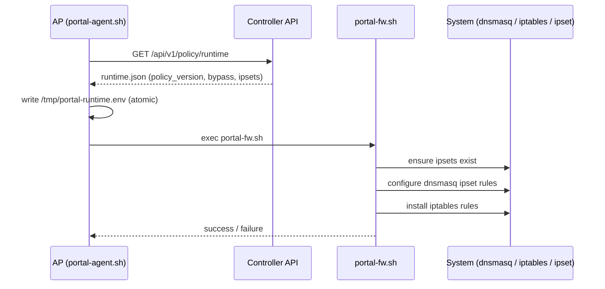
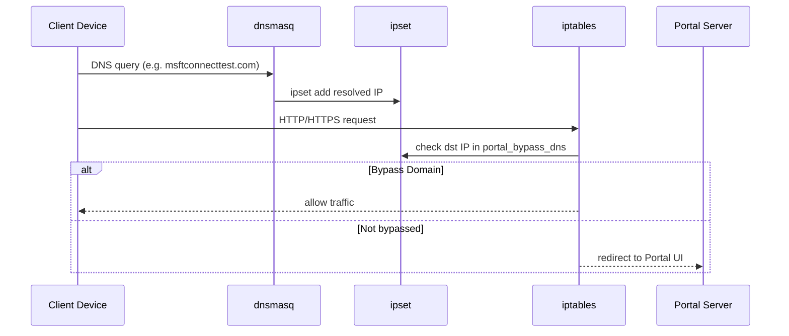
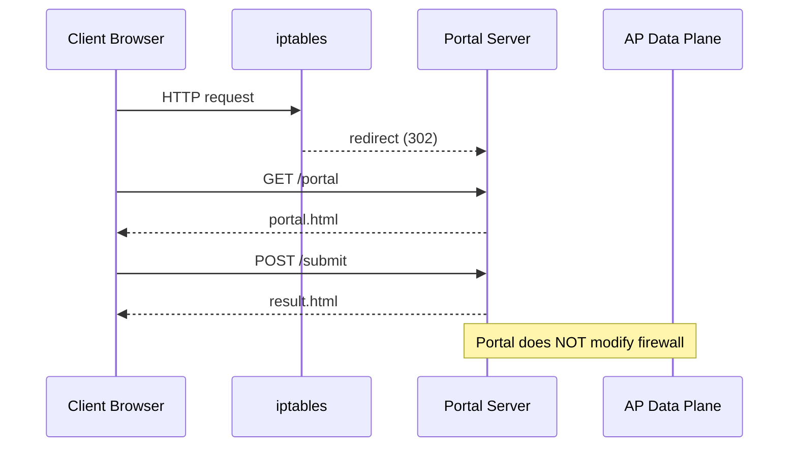
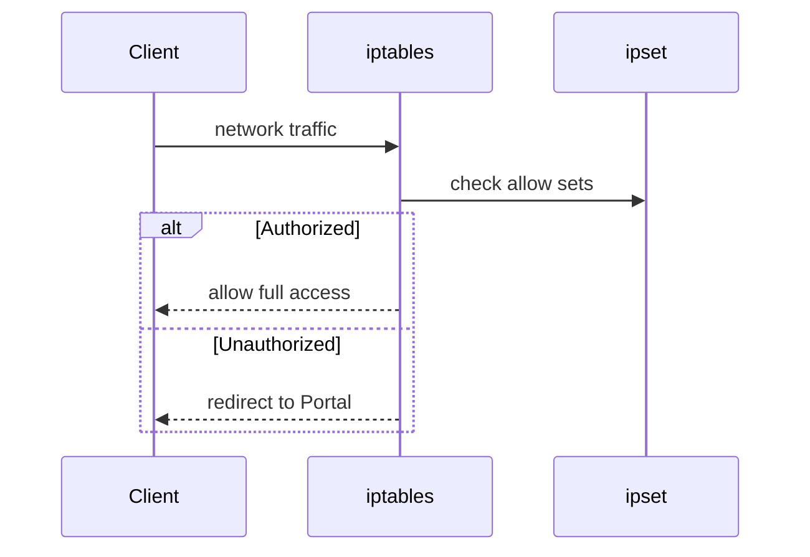
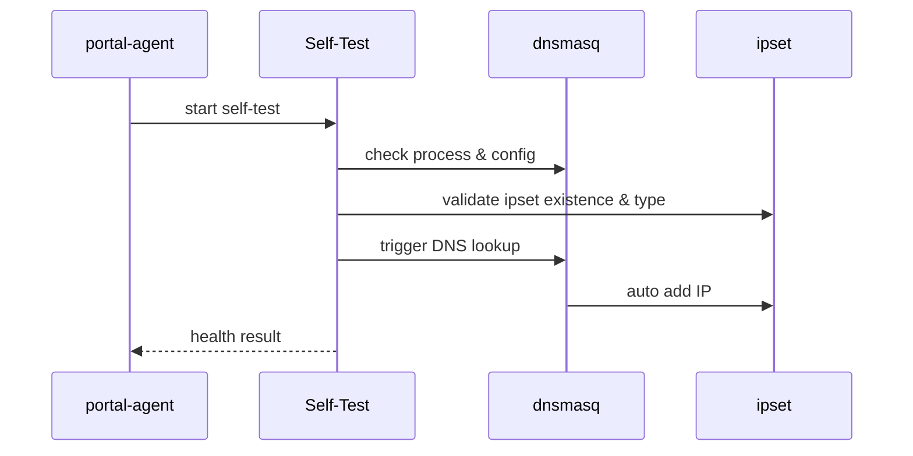
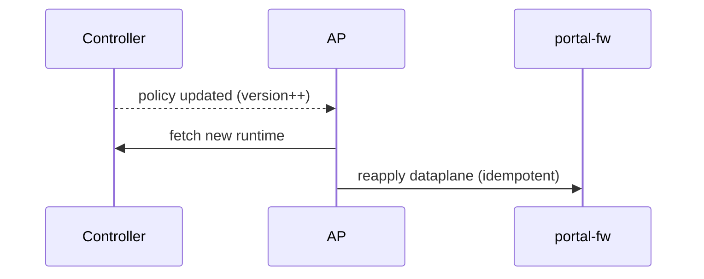

# System Sequence Diagrams

本文档描述 Enterprise AP Captive Portal 系统中的关键运行时序，
用于理解 **策略下发、DNS 旁路、Portal 弹出、健康检查** 等核心流程。

---

## 1. AP Boot & Runtime Fetch Sequence

### Description

该时序描述 AP 启动后，如何从 Control Plane 拉取运行时策略，
并在本地安全、幂等地应用到数据面。

### Sequence

### Key Points

* Runtime 文件采用 **原子写入**
* portal-fw.sh 可重复执行
* Controller 不参与任何数据面操作

---

## 2. Client Network Join & OS Portal Detection

### Description

该时序描述客户端接入 Wi-Fi 后，
操作系统如何通过 **Portal Detection 域名** 判断网络状态，
以及系统如何正确响应。

### Sequence

### Key Points

* dnsmasq **自动**写入 ipset
* 数据面不调用 `ipset add`
* HTTPS 流量不被劫持

---

## 3. Captive Portal Interaction Flow

### Description

该时序描述当客户端被重定向到 Portal 后，
Portal 与数据面之间的职责划分。

### Sequence

### Key Points

* Portal 只负责用户交互
* 放行决策始终由 Data Plane 完成
* Portal 与防火墙解耦

---

## 4. Authentication Completion & Access Grant

### Description

该时序描述认证完成后，
数据面如何基于 MAC / IP / Session 放行用户。

### Sequence

### Key Points

* 授权状态由 ipset 表达
* 放行逻辑简单、可验证
* 不依赖 Portal 状态

---

## 5. Dataplane Health Check Sequence

### Description

该时序描述 `portal-agent --check` 的执行路径，
用于验证数据面是否处于健康状态。

### Sequence

### Key Points

* 真实 DNS 查询
* 不 mock、不假设
* 可被 Controller / Prometheus 调用

---

## 6. Policy Update & Reapply Sequence

### Description

该时序描述策略更新后，
AP 如何安全地重新应用数据面规则。

### Sequence

### Key Points

* 无需重启 AP
* 不清空现有授权状态
* 策略升级安全

---

## Design Summary

通过上述时序可以看到：

* DNS 是唯一“隐式信号”
* Data Plane 是最终裁决者
* Control Plane 只负责策略
* Portal 只负责用户体验

这套时序设计确保了：

* HTTPS 时代的正确 Portal 行为
* 清晰的职责边界
* 可维护、可扩展的系统演进路径
